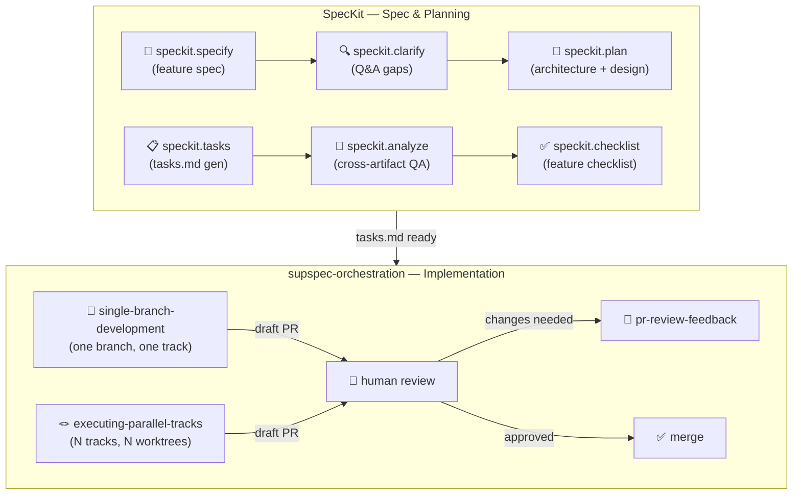

# supspec-orchestration 🚀

**Spec-driven implementation orchestration for GitHub Copilot agents.**

A portable bundle of three composable [Copilot Agent Skills](https://docs.github.com/en/copilot/how-tos/provide-context/use-agent-skills) plus a mechanical hooks bundle that turns a spec + task list into reviewed, evidenced, draft-PR-ready code — on one branch or across many parallel tracks.

The skills share one contract: **plan upstream, implement under discipline, prove it with machine-captured evidence, hand off at a draft PR.** No skill can merge its own work.

---

## 🗺️ Where these skills fit in the full pipeline

This repo contains the **implementation half** of a two-phase pipeline. The full end-to-end flow starts with **SpecKit** (the spec/planning superpower suite) and finishes with these orchestration skills.



> **SpecKit** is not in this repo but is the expected upstream. When tasks.md is ready, hand off here.

---

## 🔄 Main flows

### Flow 1 — Single feature or bugfix

```
speckit.specify → speckit.clarify → speckit.plan → speckit.tasks
       ↓
single-branch-development (story mode, N=1)
  │  Step 0: install-hooks.sh --apply              🔧 hooks bundle
  │  Step 1: track-preflight.sh --commit           🎫 mint RUN_ID
  │  Step 2: using-git-worktrees                   🌿 isolate branch
  │  Step 3: dispatching-parallel-agents (🤖 maker subagents) 🔴 author failing tests (RED batch)
  │  Step 3b: requesting-code-review               📬 review + freeze RED suite
  │  Step 4: subagent-driven-development           🟢 implement (🤖 maker+reviewer subagents per task)
  │    └─ wraps: test-driven-development + requesting-code-review internally
  │  Step 5: verification-before-completion        ✅ freeze + evidence captured
  │  Step 6: track-sentinel.sh                     🔒 secrets/debug scan
  │  Step 7: track-report.sh → gh pr create --draft  📄 draft PR handoff
       ↓
human reviews → pr-review-feedback (if changes needed)
  │  receiving-code-review                         🧐 triage comments
  │  implement fixes + re-run verification         🔁 hooks resume
  │  track-report.sh → gh pr push                 📄 update PR
       ↓
human merges ✅
```

### Flow 2 — Parallel tracks (multiple stories at once)

```
speckit.tasks  (produces N tracks in track-manifest.md)
       ↓
executing-parallel-tracks
  │  Step 1: track-precheck.sh                     🔎 validate manifest
  │  Step 2: dispatching-parallel-agents           🪢 fan out N agents
  │  Each agent runs single-branch-development     🌿 isolated worktree
  │    └─ all 8 steps above, per track
  │  Step N+1: observe run records, triage failures 📊 track per RUN_ID
  │  Step N+2: integration sequencing (dependency order) 🔀 PRs ordered
       ↓
human reviews N draft PRs → merge queue
```

### Flow 3 — Scaffold / foundation setup

```
speckit.tasks (bootstrap tasks, no RED/GREEN cycle)
       ↓
single-branch-development (scaffold mode)
  │  Step 0-1: same hooks + preflight              🔧 🎫
  │  Step 2: using-git-worktrees                   🌿 isolate branch
  │  Step 3: dispatching-parallel-agents (🤖 maker subagents) 🪢 fan out scaffold batches (config, wiring, structure)
  │  Step 3b: requesting-code-review               📬 review whole diff (quality + governance)
  │  Step 4: verification-before-completion        ✅ compile/lint/bring-up health check
  │  Step 5-8: sentinel → report → draft PR        🔒 📄
```

### Flow 4 — Behavior-preserving refactor

```
single-branch-development (refactor mode)
  │  Step 2: using-git-worktrees                   🌿 isolate
  │  Step 3: dispatching-parallel-agents (🤖 maker subagents) 📌 pin-green + add characterization tests
  │  Step 3b: requesting-code-review               📬 review pin-green suite (must pass immediately)
  │  Step 4: subagent-driven-development           🟢 transform incrementally, keep-green (🤖 maker+reviewer subagents)
  │    └─ systematic-debugging if a test goes red  🐛
  │  Step 5: verification-before-completion        ✅ full suite all-green required
  │  Step 6-8: sentinel → report → draft PR        🔒 📄
```

---

## 🛠️ The three skills

| Skill | Role | Use when |
|---|---|---|
| 🌿 **[single-branch-development](.github/skills/single-branch-development/SKILL.md)** | Per-branch worker | One feature, bugfix, refactor, or scaffold — end-to-end on a single branch |
| 🪢 **[executing-parallel-tracks](.github/skills/executing-parallel-tracks/SKILL.md)** | Conductor | N independent tracks concurrently, each in its own worktree |
| 🔁 **[pr-review-feedback](.github/skills/pr-review-feedback/SKILL.md)** | Rework stage | Address review comments on an **existing** PR branch |

### 🌿 single-branch-development
A thin **per-branch bracket** (isolation before, evidence gate + draft-PR boundary after) around an execution core with **three modes**:

| Mode | What it does | Key superpower used |
|---|---|---|
| **scaffold** | Non-behavioral bootstrap batches (config, wiring, structure) | 🤖 `dispatching-parallel-agents` → `requesting-code-review` |
| **story** | Add or change behavior under phased TDD | 🤖 `dispatching-parallel-agents` (RED batch) → `requesting-code-review` (freeze) → 🤖 `subagent-driven-development` (GREEN) |
| **refactor** | Behavior-preserving keep-green change | 🤖 `dispatching-parallel-agents` (pin-green) → `requesting-code-review` → 🤖 `subagent-driven-development` + `systematic-debugging` |

All modes share: `using-git-worktrees` (isolation), `verification-before-completion` (evidence gate), `requesting-code-review` (self-review), and the full hooks bundle.

### 🪢 executing-parallel-tracks
The **conductor**: owns isolation, gates, traceability, and integration sequencing; delegates each track's implement/review/verify to `single-branch-development`. Project-specific facts (task → track mapping, file ownership, build commands, concurrency cap) live in a per-repo `track-manifest.md`, never hardcoded in the skill.

Superpowers used: `using-git-worktrees` (per track) → `dispatching-parallel-agents` → `single-branch-development` (×N).

### 🔁 pr-review-feedback
Turns a batch of PR review comments into applied, evidenced changes on the **existing** PR branch — no preflight-mint, no fresh RED, no new isolate. Reuses the hooks bundle in **resume mode** and closes with a PR update.

Superpowers used: `receiving-code-review` (triage) → `verification-before-completion` (re-gate) → hooks resume.

---

## ⚙️ The hooks bundle

The skills are only as strong as the worker's compliance — unless the gates are **mechanical**. Copilot [agent hooks](https://docs.github.com/en/copilot/concepts/agents/hooks) run shell commands at lifecycle points (`PreToolUse`, `PostToolUse`, `SubagentStart/Stop`, `Stop`, …) and can block a tool call before it happens. Each script **no-ops unless its env is set**, so dropping the bundle in is safe before configuring anything.

| Script | 🔗 Event | What it enforces / records |
|---|---|---|
| `track-preflight.sh` | manual (Step 1) | 🎫 Mint or recover stable `RUN_ID`; check prerequisites; persist resume breadcrumb |
| `track-guard.sh` | `PreToolUse` | 🛡️ Deny edits outside writable scope, frozen paths, artifacts, or destructive ops |
| `track-evidence.sh` | `PostToolUse` | 📸 Capture test output + code fingerprint — what the tool saw, not a model claim |
| `track-evidence-gate.sh` | `Stop` | 🚦 Block stop unless evidence is present, **fresh** (fingerprint matches tree), and passing |
| `track-meter.sh` | `PostToolUse` | 🔢 Count tool calls + heartbeat; hard-stop at `TRACK_MAX_TOOL_CALLS` |
| `track-trace.sh` | `SubagentStart/Stop` | 🔍 Record **why** each subagent was spawned (`agent_description`) + stop reason |
| `track-tokens.sh` | `Stop` | 🪙 Estimate token usage from transcript (chars÷4; clearly labelled as estimate) |
| `track-note.sh` | manual | 📝 Self-report ordered skill activations + loop counts (model-claim provenance tag) |
| `track-sentinel.sh` | `Stop` | 🔒 Scan staged diff for likely secrets / debug leftovers before handoff |
| `track-notify.sh` | `Stop` | 📣 Best-effort completion webhook |
| `track-reconcile.sh` | `SessionStart` | ♻️ Recover state from committed history + run record; stash untrusted work |
| `track-report.sh` | manual (Step 8) | 📄 Render deterministic PR-body Auto block (diff, evidence, tool calls, trace) |
| `install-hooks.sh` | manual | 📦 Idempotent, consent-gated, drift-aware installer for the whole bundle |

Everything a run records lands in `runs/<RUN_ID>.json` (gitignored). Full documentation: **[references/hooks.md](.github/skills/single-branch-development/references/hooks.md)**.

---

## 📂 Repository layout

```
.github/
  hooks/                              # installed bundle (travels with each worktree)
    track-*.sh
    track-hooks.json                  # event -> script wiring
    track-env.base.sh                 # committed repo-wide config defaults
  skills/
    single-branch-development/
      SKILL.md
      references/                     # hooks.md, scaffold/story/refactor-mode.md
      scripts/                        # canonical source for track-*.sh + install-hooks.sh
      templates/                      # track-hooks.json, track-env.sh.example, pr-body.md
      tests/                          # test-skill.sh self-test harness
    executing-parallel-tracks/
      SKILL.md
      scripts/                        # track-precheck.sh
      tests/
      track-manifest.template.md      # copy per repo; fill in track/task/ownership facts
    pr-review-feedback/
      SKILL.md
README.md
.gitignore                            # runs/ and per-worktree track-env.sh
```

> The canonical `track-*.sh` sources live under `single-branch-development/scripts/`; the copies in `.github/hooks/` are what actually run. `install-hooks.sh --check` detects drift.

---

## 🚀 Getting started

### 1️⃣ Copy skills into your repo
Copilot discovers skills under `.github/skills/**/SKILL.md`. Copy the `.github/skills/` directories into the target repo, then install the hooks:

```bash
# dry-run: print what would change
bash .github/skills/single-branch-development/scripts/install-hooks.sh

# probe for drift between sources and installed copies
bash .github/skills/single-branch-development/scripts/install-hooks.sh --check

# sync bundle + gitignore runs/ + seed track-env.base.sh
bash .github/skills/single-branch-development/scripts/install-hooks.sh --apply
```

The installer auto-detects repo signals (`go.mod`, `pyproject.toml`, `package.json`, `migrations/`) and seeds `track-env.base.sh` — repo-policy vars filled in, task-derived scope left empty so an unedited copy **fails loud**.

### 2️⃣ Configure

Edit `.github/hooks/track-env.base.sh` (committed, repo-wide policy defaults).  
Optionally add a gitignored `.github/hooks/track-env.sh` per worktree for overrides.

Precedence: `exported env` > `worktree track-env.sh` > `repo track-env.base.sh` > `script default`

Key env vars:

| Variable | Default | Purpose |
|---|---|---|
| `TRACK_ALLOWED_PREFIXES` | *(required)* | Colon-separated path prefixes the worker may edit |
| `TRACK_MAX_TOOL_CALLS` | `200` | Hard ceiling on tool calls per run |
| `TRACK_TOKEN_ESTIMATE` | `1` | Enable transcript-based token estimate at Stop |
| `TRACK_SENTINEL` | `1` | Enable secrets/debug scan at Stop |
| `RUN_ID` | minted by preflight | Stable identifier threading branch ↔ PR ↔ run record |

### 3️⃣ Invoke a skill
Point Copilot at the task and let the skill drive:

- *"implement this story using single-branch-development"* → Flow 1
- *"run tracks 1, 2, 3 in parallel using executing-parallel-tracks"* → Flow 2
- *"address the PR review comments using pr-review-feedback"* → Flow 4

The worker stops at `gh pr create --draft`. **A human owns the merge.**

### 4️⃣ Self-test the bundle

```bash
bash .github/skills/single-branch-development/tests/test-skill.sh
bash .github/skills/executing-parallel-tracks/tests/test-skill.sh
```

---

## 🧠 Design principles

| Principle | Meaning |
|---|---|
| 📸 **Evidence before assertions** | A run cannot *claim* done — the evidence gate reads fingerprinted test output |
| 🛡️ **Fail-secure gates** | Scope, frozen paths, and destructive ops denied by default; you opt into looser behavior explicitly |
| 🚫 **No self-merge** | Every worker stops at a draft PR — integration is a human/merge-queue decision |
| 🧵 **Independently traceable** | One `RUN_ID` threads branch ↔ PR ↔ commit trailer ↔ run record |
| ♻️ **Self-recovering** | State lives in committed history + `runs/<RUN_ID>.json`, not model memory |
| 🔩 **Mechanical where possible** | Hooks enforce paths/commands/counters; judgement gates stay as instructions |

---

## License

See repository settings. These skills are provided as-is for orchestrating Copilot agent workflows.
