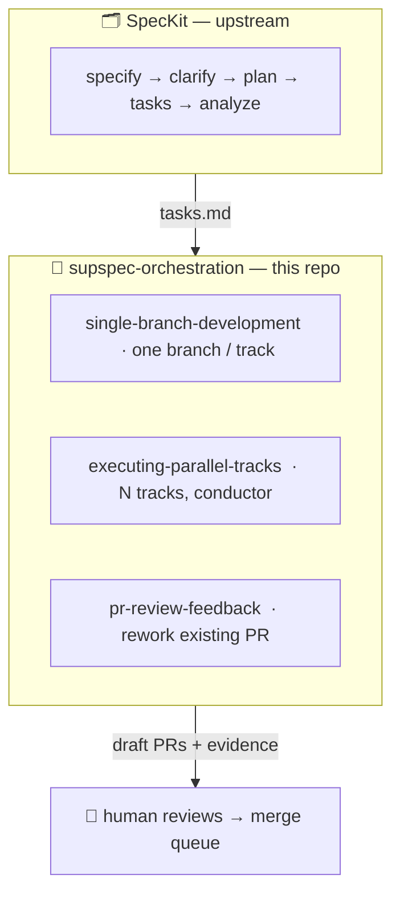

# 🌱 Supspec Orchestration 🤖

> ⚠️ **This repo is under active development.** Test it thoroughly in your own context before using in production.

**Autonomous agent workflows that turn a SpecKit `tasks.md` into 1 or N evidenced draft PRs —**  
gated by mechanical hooks, composed from Superpowers. No self-merge. Ever.

This is an **orchestration layer** sitting on top of SpecKit artifacts (spec/plan/tasks) and Superpowers skills, automating the gap from "I have a task list" to "I have a reviewed, fingerprint-evidenced draft PR waiting for a human."

1. **Feed it a `tasks.md`** — or a spec, or just a list of stories.
2. **It analyzes** whether tasks are independent, produces a wave plan, and asks for your confirmation before touching any branch.
3. **Autonomous agents run** in isolated worktrees — scaffold, story, or refactor modes, or a mix.
4. **Mechanical hooks enforce** scope boundaries, evidence freshness, token ceilings, and a secrets scan. Every run is observable and resumable.
5. **Each agent stops at a draft PR** — fingerprinted evidence, deterministic Auto block, ready for a reviewer.
6. **A human owns the merge.** Always.

Built on **[SpecKit](https://github.com/github/spec-kit)** (spec → plan → tasks upstream) + the **[Superpowers](https://github.com/obra/superpowers)** catalog (skills + dispatched subagents downstream).

---

## Table of Contents

- [🗺️ Where these skills fit in the pipeline](#️-where-these-skills-fit-in-the-full-pipeline)
- [📋 Prerequisites](#-prerequisites)
- [🔤 Concepts: Track and Wave](#-concepts-track-and-wave)
- [🔄 Main flows](#-main-flows)
- [🛠️ The three skills](#️-the-three-skills)
- [🧬 Anatomy of a skill](#-anatomy-of-a-skill)
- [⚙️ The hooks bundle](#️-the-hooks-bundle)
- [📸 Evidence](#-evidence)
- [📦 Run artifacts](#-run-artifacts-run-record--pr-body)
- [🔍 Tracing and observability](#-tracing-and-observability)
- [📂 Repository layout](#-repository-layout)
- [🚀 Getting started](#-getting-started)
- [🧠 Design principles](#-design-principles)
- [🔗 Key files](#-key-files)
- [License](#license)

---

## 🗺️ Where these skills fit in the full pipeline



---

## 📋 Prerequisites

Before using these skills in your repo:

1. **[SpecKit](https://github.com/github/spec-kit)** installed and a `tasks.md` generated (or equivalent task list).
2. **[Superpowers](https://github.com/obra/superpowers)** skills catalog installed and discoverable by your agent — under `.github/skills/` for Copilot, or under `.claude/skills/` (project) / as the Superpowers plugin for **Claude Code** (see [Runs on Copilot and Claude Code](#runs-on-copilot-and-claude-code)).
3. A Parallel Tracks Orchestrator Manifest at `.github/tracks/manifest.md` for parallel tracks (or let `executing-parallel-tracks` derive one from `tasks.md` and confirm with you at Step 0).
4. `git` with worktree support; `gh` CLI authenticated; `jq` available.
5. Docker available if any track runs integration suites.
6. Mechanical gates via lifecycle hooks (optional but recommended — makes scope/evidence gates mechanical rather than prompt-trusted): Copilot [agent hooks](https://docs.github.com/en/copilot/concepts/agents/hooks) in `.github/hooks/`, **or** Claude Code [hooks](https://docs.claude.com/en/docs/claude-code/hooks) in `.claude/settings.json`. Both are installed by the same `install-hooks.sh` — pick the surface with `--surface`.

---

## 🔤 Concepts: Track and Wave

**Track** — a group of related tasks executed as a unit on one isolated branch/worktree, corresponding to one user story or feature slice. A track has an owner (its worker agent), a defined file-ownership scope, and produces exactly one draft PR.

**Wave** — a group of tracks that can run in parallel because they have non-overlapping file ownership and no inter-dependencies. Waves are sequential: Wave 2 starts only after Wave 1's PRs are merged. Within a wave, all tracks run concurrently.

```
Wave 1: [Track A]  [Track B]  [Track C]   ← all parallel, disjoint ownership
           ↓           ↓           ↓
        PR-A        PR-B        PR-C
           ↓ merge queue ↓
Wave 2: [Track D]  [Track E]             ← parallel, depend on Wave 1
```

This is why Step 0 of `executing-parallel-tracks` analyzes dependencies and groups tasks into waves before fanning out any workers.

---

## 🔄 Main flows

### Flow 1 — Scaffold (non-behavioral bootstrap)
> **Skill:** `single-branch-development` in **scaffold mode**
```
Step 1: track-preflight.sh --persist  🎫 mint RUN_ID, confirm scope
Step 2: using-git-worktrees           🌿 isolate on a branch
Step 3: dispatching-parallel-agents   🤖 parallel scaffold batches (no TDD)
Step 4: requesting-code-review        🔎 self-review quality + governance
Step 5: verification-before-completion 🚦 evidence gate (fingerprint match)
Step 8: gh pr create --draft          📬 stop here — human reviews
```

### Flow 2 — Single feature/bugfix (story mode, TDD)
> **Skill:** `single-branch-development` in **story mode** (N=1 for a single task/bugfix)
```
Step 1: track-preflight.sh --persist  🎫 mint RUN_ID, confirm scope
Step 2: using-git-worktrees           🌿 isolate on a branch
Step 3: dispatching-parallel-agents   🤖 RED batch — write failing tests
Step 4: requesting-code-review        🔎 freeze test API (maker/checker)
Step 5: subagent-driven-development   🤖 GREEN — make tests pass
Step 6: verification-before-completion 🚦 evidence gate (fingerprint match)
Step 7: requesting-code-review        🔎 full self-review
Step 8: gh pr create --draft          📬 stop here — human reviews
```

### Flow 3 — Refactor (behavior-preserving, keep-green)
> **Skill:** `single-branch-development` in **refactor mode**
```
Step 1: track-preflight.sh --persist  🎫 mint RUN_ID, confirm scope
Step 2: using-git-worktrees           🌿 isolate on a branch
Step 3: dispatching-parallel-agents   🤖 pin-green (snapshot passing suite)
Step 4: requesting-code-review        🔎 freeze baseline
Step 5: subagent-driven-development   🤖 refactor; systematic-debugging on red
Step 6: verification-before-completion 🚦 evidence gate
Step 7: requesting-code-review        🔎 full self-review
Step 8: gh pr create --draft          📬 stop here — human reviews
```

### Flow 4 — Parallel tracks (N stories at once)
> **Skill:** `executing-parallel-tracks` — composes `dispatching-parallel-agents` + N× `single-branch-development`
```
Step 0: Analyze & plan waves          📊 derive dependencies, wave plan, CONFIRM
Step 1: track-wave-preflight.sh       🌊 mint WAVE_ID + per-track RUN_IDs, persist wave dispatch
        track-precheck.sh             🔎 validate manifest + ownership overlap
Step 2: using-git-worktrees (×N)      🌿 one isolated worktree per track
Step 3: dispatching-parallel-agents   🪢 fan out N worker agents
  Each agent runs single-branch-development  🔄 full pipeline per track
Step N+1: observe run records         📊 triage by RUN_ID (wave prefix → all tracks visible)
Step N+2: integration sequencing      🔀 PRs ordered by dependency
Step 7:   track-wave-preflight.sh --complete  🏁 close wave dispatch (final_status)
       ↓
human reviews N draft PRs → merge queue
```

---

## 🛠️ The three skills

| Skill | Role | Use when |
|---|---|---|
| 🌿 **[single-branch-development](.github/skills/single-branch-development/SKILL.md)** | Per-branch worker | One feature, bugfix, refactor, or scaffold — end-to-end on a single branch |
| 🪢 **[executing-parallel-tracks](.github/skills/executing-parallel-tracks/SKILL.md)** | Conductor | N independent tracks concurrently, each in its own worktree |
| 🔁 **[pr-review-feedback](.github/skills/pr-review-feedback/SKILL.md)** | Rework stage | Address review comments on an **existing** PR branch |

### 🌿 single-branch-development
A thin **per-branch bracket** (isolation before, evidence gate + draft-PR boundary after) around an execution core with **three modes**:

| Mode | What it does | Key superpower used |
|---|---|---|
| **scaffold** | Non-behavioral bootstrap batches (config, wiring, structure) | 🤖 `dispatching-parallel-agents` → `requesting-code-review` |
| **story** | Add or change behavior under phased TDD | 🤖 `dispatching-parallel-agents` (RED batch) → `requesting-code-review` (freeze) → 🤖 `subagent-driven-development` (GREEN) |
| **refactor** | Behavior-preserving keep-green change | 🤖 `dispatching-parallel-agents` (pin-green) → `requesting-code-review` → 🤖 `subagent-driven-development` + `systematic-debugging` |

All modes share: `using-git-worktrees` (isolation), `verification-before-completion` (evidence gate), `requesting-code-review` (self-review), and the full hooks bundle.

> **Governance note.** `requesting-code-review` dispatches a reviewer subagent that automatically inherits any `.github/instructions/*.instructions.md` file whose `applyTo` glob matches the changed files — so `code-review-generic.instructions.md` (`applyTo: '**'`) is always in scope, and language/framework-specific instructions (`go.instructions.md`, `reactjs.instructions.md`, …) apply whenever the diff touches matching paths. No extra wiring needed.

### 🪢 executing-parallel-tracks
The **conductor**: owns isolation, gates, traceability, and integration sequencing; delegates each track's implement/review/verify to `single-branch-development`. Starts with a dependency-aware wave analysis (Step 0) that derives a wave plan and requires your confirmation before spawning any worker.

Superpowers used: `using-git-worktrees` (per track) → `dispatching-parallel-agents` → `single-branch-development` (×N).

### 🔁 pr-review-feedback
Turns a batch of PR review comments into applied, evidenced changes on the **existing** PR branch — no preflight-mint, no fresh RED, no new isolate. Reuses the hooks bundle in **resume mode** and closes with a PR update.

Superpowers used: `receiving-code-review` (triage) → 🤖 `dispatching-parallel-agents` (optional, independent fixes) → `requesting-code-review` (re-review fix delta) → `verification-before-completion` (re-evidence).

---

## 🧬 Anatomy of a skill

Every top-level skill file (`SKILL.md`) follows a consistent section spine, so you always know where to look:

| Section | What it contains |
|---|---|
| `## When to Use` | Trigger phrases; when NOT to use |
| `## Prerequisites` | Required tools, skills, artifacts |
| `## Pipeline` | Numbered steps, exactly what happens in order |
| `## Skill-Per-Step Map` | Table: step → what fires → kind (skill / subagent / script) |
| `## Quality Gates` | What this skill owns — precheck, verifier, merge, evidence gates |
| `## Gotchas` | Known footguns with mitigations |
| `## References` | Links to deep-dive docs and related skills |

Deep-dive docs (scaffold/story/refactor modes, hooks reference) live under `references/` inside each skill directory.

---

## ⚙️ The hooks bundle

The skills are only as strong as the worker's compliance — unless the gates are **mechanical**. Copilot [agent hooks](https://docs.github.com/en/copilot/concepts/agents/hooks) run shell commands at lifecycle points (`PreToolUse`, `PostToolUse`, `SubagentStart/Stop`, `Stop`, …) and can block a tool call before it happens. Each script **no-ops unless its env is set**, so dropping the bundle in is safe before configuring anything.

Scripts are listed in the order they typically fire across a track's lifetime:

| Script | 🔗 Trigger Event | Type / Kind | What it enforces / records |
|---|---|---|---|
| `install-hooks.sh` *(repo-wide)* | skill-invoked (setup) | **Lifecycle** | 📦 Idempotent, consent-gated, drift-aware installer for the whole bundle |
| `track-preflight.sh` *(per-track)* | skill-invoked (Step 1) | **Lifecycle** | 🎫 Mint or recover stable `RUN_ID`; check prerequisites; persist resume breadcrumb |
| `track-reconcile.sh` *(per-track)* | `SessionStart` | **Lifecycle** | ♻️ Recover state from committed history + run record; stash untrusted work |
| `track-guard.sh` *(repo-policy)* | `PreToolUse` | **Scope & guard** | 🛡️ Deny edits outside writable scope, frozen paths, artifacts, or destructive ops |
| `track-evidence.sh` *(per-track)* | `PostToolUse` | **Evidence & quality** | 📸 Capture test output + code fingerprint — what the tool saw, not a model claim |
| `track-meter.sh` *(repo-policy)* | `PostToolUse` | **Governance** | 🔢 Count tool calls + heartbeat; hard-stop at `TRACK_MAX_TOOL_CALLS` |
| `track-trace.sh` *(per-track)* | `SubagentStart/Stop` | **Observability** | 🔍 Record **why** each subagent was spawned (`agent_description`) + stop reason |
| `track-note.sh` *(per-track)* | skill-invoked (each core step) | **Observability** | 📝 Self-report ordered skill activations + loop counts (model-claim provenance tag) |
| `track-sentinel.sh` *(repo-policy)* | `Stop` | **Scope & guard** | 🔒 Scan staged diff for likely secrets / debug leftovers before handoff |
| `track-evidence-gate.sh` *(repo-policy)* | `Stop` | **Evidence & quality** | 🚦 Block stop unless evidence is present, **fresh** (fingerprint matches tree), and passing |
| `track-tokens.sh` *(repo-policy)* | `Stop` | **Governance** | 🪙 Estimate token usage; enforce `TRACK_MAX_TOKEN_ESTIMATE` ceiling (blocks stop + writes `status=budget-exceeded`) |
| `track-notify.sh` *(repo-policy)* | `Stop` | **Lifecycle** | 📣 Best-effort completion webhook |
| `track-report.sh` *(per-track)* | skill-invoked (Step 8) | **Observability** | 📄 Render deterministic PR-body Auto block (diff, evidence, tool calls, trace) |
| `track-wave-preflight.sh` *(EPT-only)* | skill-invoked (EPT Step 1 + 7) | **Lifecycle** | 🌊 Mint/recover wave dispatch breadcrumb; derive per-track `RUN_ID`s as `<wave-id>_<track-id>`; close wave at Step 7 |

Everything a run records lands in `runs/<RUN_ID>.json` (gitignored). Full documentation: **[references/hooks.md](.github/skills/single-branch-development/references/hooks.md)**.

---

## 📸 Evidence

Evidence is what separates "the agent claimed it worked" from "the agent proved it worked." Every run must pass the evidence gate before it can open a PR.

**How it works:**
1. `track-evidence.sh` captures test command output + a SHA fingerprint of the working tree at capture time.
2. `track-evidence-gate.sh` at `Stop` checks: evidence present? fingerprint matches the current tree? all kinds passing?
3. If the tree changed after capture (stale fingerprint) or evidence is missing → the gate blocks the agent from stopping.

**Stack-aware defaults.** `install-hooks.sh --apply` detects repo signals and seeds `track-env.base.sh` with opinionated starting points. Signals marked *(auto)* are detected by the installer; others must be added manually to `TRACK_EVIDENCE_KINDS` and `TRACK_EVIDENCE_RULES`:

| Signal | Evidence kind | Default command |
|---|---|---|
| `go.mod` present *(auto)* | `go-test` | `go test -race ./...` |
| `pyproject.toml` / `uv.lock` *(auto)* | `py` | `uv run pytest` |
| `package.json` present *(auto)* | `ts` | `tsc --noEmit && npm test` |
| `migrations/` directory *(auto)* | `pg-explain` | `psql -c 'EXPLAIN (ANALYZE, FORMAT JSON) …'` |
| NATS producers/consumers *(add manually)* | `nats` | `nats consumer info <stream> <consumer>` |
| Redis interactions *(add manually)* | `redis` | `redis-cli TTL <key>` |
| REST / gRPC contract tests *(add manually)* | `contract` | `<e.g. buf lint && buf breaking>` |
| E2E browser tests *(add manually)* | `e2e` | `npx playwright test` |

These are **additive and fully modifiable** — edit `TRACK_EVIDENCE_KINDS` and `TRACK_EVIDENCE_RULES` in `track-env.base.sh` to add, replace, or remove kinds for your stack. No rewrite needed; the installer just saves the first-run ceremony.

---

## 📦 Run artifacts: run record + PR body

Three artifact types are produced across a run. Each is owned by a specific skill — knowing this lets you grep the right file when debugging.

---

### 🌿 Produced by `single-branch-development` — every flow

**Per-track breadcrumb** (`runs/<RUN_ID>.dispatch`, gitignored). Written by `track-preflight.sh --persist` at Step 1, closed by `--complete` at Step 8. Exists for **every** SBD run — standalone (Flows 1–3) and EPT-dispatched (Flow 4). Enables resume: if the session is interrupted, `track-reconcile.sh` finds this file and rebuilds position without re-minting a new ID.

Standalone SBD run (Flows 1–3) — plain `<timestamp>_<track-id>` format, no wave prefix:
```json
{
  "run_id": "2026-07-20T14-03_us1",
  "track": "us1",
  "branch": "track/us1",
  "scope": "internal/ingest/:migrations/0007_",
  "toolchain": "go,uv",
  "evidence_floor": "go-test",
  "created_utc": "2026-07-20T14:03:00Z",
  "completed_utc": "2026-07-20T15:10:22Z",
  "duration_secs": 4042
}
```

EPT-dispatched track (Flow 4) — `RUN_ID` carries the wave prefix, derived by `track-wave-preflight.sh`:
```json
{
  "run_id": "2026-07-20T11-30_wave1_us1",
  "track": "us1",
  "branch": "track/us1",
  "scope": "internal/ingest:migrations/0007_",
  "toolchain": "go,uv",
  "evidence_floor": "go-test",
  "created_utc": "2026-07-20T11:30:00Z",
  "completed_utc": "2026-07-20T12:15:42Z",
  "duration_secs": 2742
}
```

**Run record** (`runs/<RUN_ID>.json`, gitignored). One per track, populated by hooks — never re-typed by the model. Contains the full observability payload:

```json
{
  "run_id": "2026-06-26T14-03_us1",
  "track": "us1",
  "status": "success",
  "evidence": { "go-test": "42 passed", "ts": "0 errors" },
  "tool_calls": 137,
  "token_estimate": 48000,
  "trace": [
    { "t": "…", "kind": "subagent", "event": "start", "agent_id": "sub-01", "agent_type": "implementer", "reason": "green T038 impl" },
    { "t": "…", "kind": "subagent", "event": "stop",  "agent_id": "sub-01", "agent_type": "implementer", "stop_reason": "done" }
  ],
  "skills": [
    { "t": "…", "skill": "subagent-driven-development", "step": "4-green", "self_reported": true }
  ]
}
```

---

### 🪢 Produced by `executing-parallel-tracks` — Flow 4 only

**Wave dispatch breadcrumb** (`runs/<WAVE_ID>.wave.dispatch`, gitignored). Written by `track-wave-preflight.sh --persist` before fan-out, closed by `--complete` after all tracks finish. **EPT-only** — standalone SBD runs do not produce this file. It is the durable orchestrator resume anchor: if interrupted, the wave's `track_run_ids[]` list is the authoritative source for reconstructing per-track state.

One wave with 3 tracks produces **4 files** sharing the same `WAVE_ID` prefix — `ls runs/*wave1*` shows the whole fleet at a glance:
```
runs/2026-07-20T11-30_wave1.wave.dispatch      ← orchestrator breadcrumb (track-wave-preflight.sh)
runs/2026-07-20T11-30_wave1_us1.json           ← per-track run record (track-preflight.sh)
runs/2026-07-20T11-30_wave1_us2.json
runs/2026-07-20T11-30_wave1_us3.json
```

```json
{
  "wave_id": "2026-07-20T11-30_wave1",
  "wave_number": 1,
  "base_ref": "origin/main",
  "base_sha": "abc123def456",
  "track_run_ids": [
    "2026-07-20T11-30_wave1_us1",
    "2026-07-20T11-30_wave1_us2",
    "2026-07-20T11-30_wave1_us3"
  ],
  "status": "all-success",
  "created_utc": "2026-07-20T11:30:00Z",
  "completed_utc": "2026-07-20T12:18:05Z",
  "final_status": "all-success",
  "duration_secs": 2885
}
```
`final_status` values: `all-success` | `partial-blocked` | `budget-exceeded` | `aborted`.

---

**`status` values** — written by hooks, never by the model:

| Status | Set when | Hook responsible |
|---|---|---|
| `success` | All evidence gates pass and run ends cleanly | `track-evidence-gate.sh` |
| `blocked` | A hard dependency is unresolvable (e.g. ownership collision, preflight fail) | `track-preflight.sh` / worker |
| `no-progress` | Tool-call ceiling reached with no forward movement | `track-meter.sh` |
| `budget-exceeded` | Token-estimate ceiling reached (`TRACK_MAX_TOKEN_ESTIMATE`) | `track-tokens.sh` |

`trace[]` = hook-observed subagent events (mechanical facts). `skills[]` = model's self-reported activations (provenance-tagged). Never mix them.

**PR body** (`templates/pr-body.md`). Two-zone template:

```
## Auto (generated — do not edit)
<!-- track-report.sh renders this block from runs/<RUN_ID>.json:
     files changed, evidence fingerprints + pass/fail, tool_calls, trace[] -->

## Asserted (author-written)
<!-- Human-readable context: what changed, why, any known gaps -->
```

`track-report.sh` fills the Auto block deterministically from the run record. The Asserted zone is the only place the model writes prose.

---

## 🔍 Tracing and observability

Every run is independently traceable through one `RUN_ID` threaded across four surfaces:

| Surface | Where the RUN_ID lives |
|---|---|
| Branch name | `track/us1` (run-id in run record if branch name is fixed) |
| Draft PR title | `track/us1 [run 2026-06-26T14-03_us1]` |
| Commit trailer | `Run-Id: 2026-06-26T14-03_us1` |
| Run record file | `runs/2026-06-26T14-03_us1.json` |

Grep any one surface → reconstruct the whole run. `runs/summary.md` aggregates all tracks for a wave.

**What the run record captures automatically** (no model involvement):
- `tool_calls` + heartbeat (`track-meter.sh`, every `PostToolUse`)
- `trace[]` subagent start/stop events (`track-trace.sh`, every `SubagentStart/Stop`)
- Evidence fingerprints + pass/fail (`track-evidence.sh`, on test tool calls)
- Token estimate + PR-body Auto block (`track-tokens.sh` + `track-report.sh`, at `Stop`)

**What is self-reported** (model's claim, `self_reported:true`):
- `skills[]` — which skill was active at each step (`track-note.sh skill <name>`)
- `iterations` — RED→GREEN loop count (`track-note.sh loop <phase>`)

---

## 📂 Repository layout

```
.github/
  hooks/                              # installed bundle (travels with each worktree)
    track-*.sh
    track-hooks.json                  # event -> script wiring
    track-env.base.sh                 # committed repo-wide config defaults
  instructions/                       # governance gate — applied by every review step
    security-and-owasp.instructions.md
    go.instructions.md
    python.instructions.md
    reactjs.instructions.md
    state-management.instructions.md
    code-review-generic.instructions.md
    backing-services.instructions.md  # PostgreSQL, Redis, NATS, Qdrant, MinIO, Casdoor, Caddy
    devops-cicd.instructions.md       # Docker, Compose, Makefile, GitHub Actions
  skills/
    single-branch-development/
      SKILL.md
      references/                     # hooks.md, scaffold/story/refactor-mode.md
      scripts/                        # canonical source for track-*.sh + install-hooks.sh
      templates/                      # track-hooks.json, track-env.sh.example, pr-body.md
      tests/                          # test-skill.sh self-test harness
    executing-parallel-tracks/
      SKILL.md
      scripts/                        # track-precheck.sh, track-wave-preflight.sh
      tests/
      track-manifest.template.md      # copy to .github/tracks/manifest.md per repo; fill in orchestrator facts
    pr-review-feedback/
      SKILL.md
README.md
.gitignore                            # runs/ and per-worktree track-env.sh
```

> The canonical `track-*.sh` sources live under `single-branch-development/scripts/`; the copies in `.github/hooks/` are what actually run. `install-hooks.sh --check` detects drift.

---

## 🚀 Getting started

### 1️⃣ Copy skills into your repo
Copy the skill directories into the target repo where **your agent discovers skills**:

- **Copilot** discovers skills under `.github/skills/**/SKILL.md` — copy `.github/skills/` as-is.
- **Claude Code** discovers skills under `.claude/skills/**/SKILL.md` (project scope). Copy the skill
  directories there, preserving the tree (the skills cross-reference each other by relative path, e.g.
  `../executing-parallel-tracks/SKILL.md`):
  ```bash
  mkdir -p .claude/skills
  cp -R .github/skills/single-branch-development .claude/skills/
  cp -R .github/skills/executing-parallel-tracks .claude/skills/
  cp -R .github/skills/pr-review-feedback        .claude/skills/
  ```

Then install the hooks (the `track-*.sh` scripts stay in `.github/hooks/` for both surfaces; only the
wiring differs):

```bash
# dry-run: print what would change
bash .github/skills/single-branch-development/scripts/install-hooks.sh

# probe for drift between sources and installed copies
bash .github/skills/single-branch-development/scripts/install-hooks.sh --check

# sync bundle + gitignore runs/ + seed track-env.base.sh + wire hooks (default: both surfaces)
bash .github/skills/single-branch-development/scripts/install-hooks.sh --apply

# wire ONLY Claude Code (.claude/settings.json) or ONLY Copilot (.github/hooks/track-hooks.json)
bash .github/skills/single-branch-development/scripts/install-hooks.sh --apply --surface claude
bash .github/skills/single-branch-development/scripts/install-hooks.sh --apply --surface copilot
```

The installer auto-detects repo signals (`go.mod`, `pyproject.toml`, `package.json`, `migrations/`) and seeds `track-env.base.sh` — repo-policy vars filled in, task-derived scope left empty so an unedited copy **fails loud**.

### 2️⃣ Configure

Edit `.github/hooks/track-env.base.sh` (committed, repo-wide policy defaults).  
Optionally add a gitignored `.github/hooks/track-env.sh` per worktree for overrides.

Precedence: `exported env` > `worktree track-env.sh` > `repo track-env.base.sh` > `script default`

Key env vars (set in `track-env.base.sh` unless noted):

**Scope & guard** *(repo-policy — set once, same for every track)*

| Variable | Default | Purpose |
|---|---|---|
| `TRACK_ALLOWED_PREFIXES` | *(required — empty = deny all edits)* | Colon-separated path prefixes the worker may write |
| `TRACK_FROZEN_PATHS` | `""` | Space-separated exact files no worker may edit |
| `TRACK_IMMUTABLE_PREFIXES` | `migrations/` | Committed files here are append-only |
| `TRACK_GUARD_DESTRUCTIVE` | `1` | Deny irreversible shell/DB ops (rm -rf, data-wipe commands) |
| `TRACK_ALLOW_FF_PUSH` | `""` | Set to `1` only for `pr-review-feedback` (update existing PR branch) |

**Evidence & quality** *(repo-policy; EVIDENCE_RULES/KINDS are additive — edit, don't replace)*

| Variable | Default | Purpose |
|---|---|---|
| `TRACK_EVIDENCE_KINDS` | `go-test:…;py:…;ts:…` | `label:command` pack — what commands produce evidence |
| `TRACK_EVIDENCE_RULES` | see table below | Auto-require evidence kinds based on which files changed |
| `TRACK_REQUIRED_EVIDENCE` | `""` *(task-derived)* | Extra kinds required on every diff regardless of rules |
| `TRACK_BASE_REF` | `origin/main` | Base ref for the diff — wrong value silently passes an empty diff |

`TRACK_EVIDENCE_RULES` is a `;`-separated list of `path-glob:kind` pairs. The gate resolves which kinds are required by matching changed files against these globs:

| path glob | kind |
|---|---|
| `*.go` | `go-test` |
| `*.py` | `py` |
| `*.ts` | `ts` |
| `*.tsx` | `ts` |
| `migrations/*` | `pg-explain` |
| `*/queries/*.sql` | `pg-explain` |
| `*/events/*` | `nats` |
| `*/cache/*` | `redis` |

Example value: `*.go:go-test;*.py:py;*.tsx:ts;*.ts:ts;migrations/*:pg-explain`

**Run lifecycle** *(mix of repo-policy and per-track)*

| Variable | Default | Purpose |
|---|---|---|
| `RUN_ID` | minted by preflight | Stable identifier threading branch ↔ PR ↔ commit trailer ↔ run record |
| `RUNS_DIR` | `runs` | Directory for run records — must be gitignored |
| `TRACK_MAX_TOOL_CALLS` | `200` | Hard ceiling on tool calls; run halts when reached |
| `TRACK_MAX_TOKEN_ESTIMATE` | `200000` | Token-estimate ceiling; blocks stop + writes `status=budget-exceeded` when exceeded. Set to `0` to disable. |
| `TRACK_SENTINEL` | `1` | Scan staged diff for likely secrets/debug leftovers at Stop |
| `TRACK_NOTIFY_WEBHOOK` | `""` | URL for best-effort completion webhook; empty = no notify |
| `PREFLIGHT_REQUIRE_GH` | `1` | Require authenticated `gh` CLI at preflight (set `0` on bootstraps without a remote) |

### 3️⃣ Invoke a skill
Point your agent at the task and let the skill drive. On **Copilot**, reference the skill by name; on
**Claude Code**, invoke it with `/single-branch-development` (or `/executing-parallel-tracks`) or name
it in the request — Claude Code loads the matching `SKILL.md`:

- *"implement Phase 1 Setup — shared infrastructure (T001–T010a) **using single-branch-development skill**"* → Flow 1 (scaffold)
- *"implement Phase 3 User Story 1: Ingest knowledge into a searchable library (T035–T056) **using single-branch-development skill**"* → Flow 2 (story/TDD)
- *"refactor Phase 2 Foundational — frontend API client (T031) **using single-branch-development skill**"* → Flow 3 (refactor)
- *"execute Phase 3 US1, Phase 4 US2, Phase 5 US3 in parallel **using executing-parallel-tracks skill**"* → Flow 4 (parallel)

The worker stops at `gh pr create --draft`. **A human owns the merge.**

---

## Runs on Copilot and Claude Code

The skills and the hook bundle run under **both** GitHub Copilot agents and **Claude Code**. The hook
`track-*.sh` scripts are surface-agnostic — they already speak Claude Code's hook JSON (`tool_name`,
snake_case `tool_input.file_path` / `tool_input.command`, `hook_event_name`, `stop_hook_active`,
`transcript_path`) and emit Claude Code's decisions (`permissionDecision:"deny"` on `PreToolUse`,
`{decision:"block"}` / `{continue:false}` on `Stop`). Only two things differ per surface:

| | Copilot | Claude Code |
|---|---|---|
| **Skill discovery** | `.github/skills/**/SKILL.md` | `.claude/skills/**/SKILL.md` (or the Superpowers plugin) |
| **Hook wiring** | `.github/hooks/track-hooks.json` | `.claude/settings.json` (`hooks` block) |
| **Install** | `install-hooks.sh --surface copilot` | `install-hooks.sh --surface claude` |
| **Governance files** | `.github/instructions/*` auto-injected by `applyTo` | read in-session by the skill's Step 4 (no auto-inject needed) |
| **Subagent trace** | `SubagentStart` + `SubagentStop` (spawn reason recorded) | `SubagentStop` only (count + heartbeat; no spawn reason) |

**Claude Code setup in one paragraph:** install the [Superpowers](https://github.com/obra/superpowers)
skills for Claude Code (as a plugin or under `.claude/skills/`) so the referenced skills
(`subagent-driven-development`, `dispatching-parallel-agents`, `requesting-code-review`,
`using-git-worktrees`, `verification-before-completion`, …) resolve; copy these three orchestration
skills into `.claude/skills/` (step 1️⃣ above); then run `install-hooks.sh --apply --surface claude`
to wire `.claude/settings.json`. See
[`single-branch-development/references/hooks.md`](.github/skills/single-branch-development/references/hooks.md#running-under-claude-code)
for the full event/matcher mapping and the two Claude Code deltas.

### 4️⃣ Self-test the bundle

```bash
bash .github/skills/single-branch-development/tests/test-skill.sh
bash .github/skills/executing-parallel-tracks/tests/test-skill.sh
```

The test harnesses are a **documentation-contract fence + functional regression suite** in one:
- **122 SBD tests** cover: preflight flag behavior (`--persist`, `--complete`, breadcrumb stamping), guard allow/deny decisions (scope, frozen paths, destructive ops, FF-push gating), evidence capture + gate (fingerprint freshness, stale detection, multi-kind), meter counting + hard-stop, trace schema, sentinel pattern matching, report Auto-block rendering, run-record field completeness, token ceiling enforcement (`TRACK_MAX_TOKEN_ESTIMATE`), and structural checks on SKILL.md / hooks.md / templates.
- **195 EPT tests** cover: SKILL.md structural integrity (Steps 0–7, gates, wave planner), manifest template completeness, run-record schema (trace[]/ skills[] separation), precheck ownership-overlap detection (disjoint / overlapping / shared hotspot / 3-way), and structural governance assertions.

---

## 🧠 Design principles

1. **Mechanical over prompt-trusted.** If a gate can be enforced by a hook, it is. The model complying is secondary.
2. **Hooks are no-ops until configured.** Drop the bundle in any repo — nothing changes until you set env vars.
3. **Evidence is fingerprinted, not narrated.** The gate checks the tree hash, not the agent's summary.
4. **No self-merge.** Every pipeline terminates at a draft PR. A human decides what merges.
5. **Observable by RUN_ID.** One stable ID threads branch, PR, commit, and run record. Grep any surface, reconstruct the whole run.
6. **Confirm before fan-out.** Step 0 requires explicit human sign-off on the wave plan before spawning any worker. A bad plan is infinitely cheaper to fix before workers are running than after.

---

## 🔗 Key files

| File | Purpose |
|---|---|
| `.github/skills/single-branch-development/SKILL.md` | SBD skill — full pipeline |
| `.github/skills/executing-parallel-tracks/SKILL.md` | EPT skill — conductor |
| `.github/skills/pr-review-feedback/SKILL.md` | PRF skill — rework stage |
| `.github/skills/single-branch-development/references/hooks.md` | Hook env vars + run-record schema |
| `.github/hooks/track-env.base.sh` | Committed repo-wide config (edit this) |
| `.github/hooks/track-hooks.json` | Event → script wiring |
| `.github/skills/executing-parallel-tracks/track-manifest.template.md` | Orchestrator manifest template (copy to `.github/tracks/manifest.md`) |
| `.github/skills/executing-parallel-tracks/scripts/track-wave-preflight.sh` | Wave dispatch: mint `WAVE_ID`, derive per-track `RUN_ID`s, close wave |

---

## License

MIT
