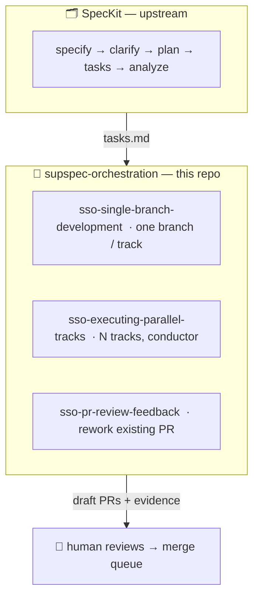

# 🌱 Supspec Orchestration 🤖

> ⚠️ **This repo is under active development.** Test it thoroughly in your own context before using in production.

**Autonomous agent workflows that turn a SpecKit `tasks.md` into 1 or N evidenced draft PRs —**  
gated by mechanical hooks, composed from Superpowers. No self-merge. Ever.

This is an **orchestration layer** sitting on top of SpecKit artifacts (spec/plan/tasks) and Superpowers skills, automating the gap from "I have a task list" to "I have a reviewed, fingerprint-evidenced draft PR waiting for a human."

1. **Feed it a `tasks.md`** — or a spec, or just a list of stories.
2. **It analyzes** whether tasks are independent, produces a wave plan, and asks for your confirmation before touching any branch.
3. **Autonomous agents run** in isolated worktrees — scaffold, story, or refactor modes, or a mix.
4. **Mechanical hooks enforce** scope boundaries, evidence freshness, token ceilings, and a secrets scan. Every run is observable and resumable.
5. **Each agent stops at a draft PR** — fingerprinted evidence, deterministic Auto block, ready for a reviewer.
6. **A human owns the merge.** Always.

Built on **[SpecKit](https://github.com/github/spec-kit)** (spec → plan → tasks upstream) + the **[Superpowers](https://github.com/obra/superpowers)** catalog (skills + dispatched subagents downstream).

---

## Table of Contents

- [🗺️ Where these skills fit in the pipeline](#️-where-these-skills-fit-in-the-full-pipeline)
- [📋 Prerequisites](#-prerequisites)
- [🔤 Concepts: Track and Wave](#-concepts-track-and-wave)
- [🔄 Main flows](#-main-flows)
- [🛠️ The three skills](#️-the-three-skills)
- [🧬 Anatomy of a skill](#-anatomy-of-a-skill)
- [⚙️ The hooks bundle](#️-the-hooks-bundle)
- [📸 Evidence](#-evidence)
- [🧾 Discipline audit](#-discipline-audit)
- [📦 Run artifacts](#-run-artifacts-run-record--pr-body)
- [🔍 Tracing and observability](#-tracing-and-observability)
- [📂 Repository layout](#-repository-layout)
- [🚀 Getting started](#-getting-started)
- [🧠 Design principles](#-design-principles)
- [🔗 Key files](#-key-files)
- [License](#license)

---

## 🗺️ Where these skills fit in the full pipeline


```mermaid
graph TD
    subgraph SK ["🗂️ SpecKit — upstream"]
        S1["specify → clarify → plan → tasks → analyze"]
    end
    subgraph SO ["🔀 supspec-orchestration — this repo"]
        B1["sso-single-branch-development  · one branch / track"]
        B2["sso-executing-parallel-tracks  · N tracks, conductor"]
        B3["sso-pr-review-feedback  · rework existing PR"]
    end
    C["👤 human reviews → merge queue"]
    SK -->|tasks.md| SO
    SO -->|draft PRs + evidence| C
```

---

## 📋 Prerequisites

Before using these skills in your repo:

1. **[SpecKit](https://github.com/github/spec-kit)** installed and a `tasks.md` generated (or equivalent task list).
2. **[Superpowers](https://github.com/obra/superpowers)** skills catalog installed and discoverable by your agent — under `.github/skills/` for Copilot, or under `.claude/skills/` (project) / as the Superpowers plugin for **Claude Code** (see [Runs on Copilot and Claude Code](#runs-on-copilot-and-claude-code)).
3. A Parallel Tracks Orchestrator Manifest at `.github/tracks/manifest.md` for parallel tracks (or let `sso-executing-parallel-tracks` derive one from `tasks.md` and confirm with you at Step 0).
4. `git` with worktree support; `gh` CLI authenticated; `jq` available.
5. Docker available if any track runs integration suites.
6. Mechanical gates via lifecycle hooks (optional but recommended — makes scope/evidence gates mechanical rather than prompt-trusted): Copilot [agent hooks](https://docs.github.com/en/copilot/concepts/agents/hooks) in `.github/hooks/`, **or** Claude Code [hooks](https://docs.claude.com/en/docs/claude-code/hooks) in `.claude/settings.json`. Both are installed by the same `install-hooks.sh` — pick the surface with `--surface`.

---

## 🔤 Concepts: Track and Wave

**Track** — a group of related tasks executed as a unit on one isolated branch/worktree, corresponding to one user story or feature slice. A track has an owner (its worker agent), a defined file-ownership scope, and produces exactly one draft PR.

**Wave** — a group of tracks that can run in parallel because they have non-overlapping file ownership and no inter-dependencies. Waves are sequential: Wave 2 starts only after Wave 1's PRs are merged. Within a wave, all tracks run concurrently.

```
Wave 1: [Track A]  [Track B]  [Track C]   ← all parallel, disjoint ownership
           ↓           ↓           ↓
        PR-A        PR-B        PR-C
           ↓ merge queue ↓
Wave 2: [Track D]  [Track E]             ← parallel, depend on Wave 1
```

This is why Step 0 of `sso-executing-parallel-tracks` analyzes dependencies and groups tasks into waves before fanning out any workers.

---

## 🔄 Main flows

### Flow 1 — Scaffold (non-behavioral bootstrap)
> **Skill:** `sso-single-branch-development` in **scaffold mode**
```
Step 1: track-preflight.sh --persist   🎫 mint RUN_ID, confirm scope
Step 2: track-reconcile.sh             ♻️ recover durable state (no-op on a fresh run)
Step 3: using-git-worktrees            🌿 isolate in a dedicated worktree
Step 4: governance gate + mode guard   📜 distil instructions; guard refuses any behavioral task
        dispatching-parallel-agents    🤖 parallel generators → controller applies (sole writer)
        requesting-code-review         🔎 one whole-diff review (+ governance)
Step 5-6: verification-before-completion 🚦 freeze & verify-all → evidence gate (one fingerprint)
Step 8: track-audit.sh → gh pr --draft 📬 audit invariants, then stop — human reviews
```

### Flow 2 — Single feature/bugfix (story mode, TDD)
> **Skill:** `sso-single-branch-development` in **story mode** (N=1 for a single task/bugfix)
```
Step 1: track-preflight.sh --persist   🎫 mint RUN_ID, confirm scope
Step 2: track-reconcile.sh             ♻️ recover durable state (no-op on a fresh run)
Step 3: using-git-worktrees            🌿 isolate in a dedicated worktree
Step 4: governance gate + mode guard   📜 distil instructions (story = default for behavioral work)
        dispatching-parallel-agents    🤖 author the RED batch — failing tests
        requesting-code-review         🔎 review + freeze the test API (maker/checker)
        subagent-driven-development    🤖 GREEN incrementally in dependency order
Step 5-6: verification-before-completion 🚦 freeze & verify-all → evidence gate (one fingerprint)
Step 8: track-audit.sh → gh pr --draft 📬 audit invariants, then stop — human reviews
```

### Flow 3 — Refactor (behavior-preserving, keep-green)
> **Skill:** `sso-single-branch-development` in **refactor mode**
```
Step 1: track-preflight.sh --persist   🎫 mint RUN_ID, confirm scope
Step 2: track-reconcile.sh             ♻️ recover durable state (no-op on a fresh run)
Step 3: using-git-worktrees            🌿 isolate in a dedicated worktree
Step 4: governance gate + mode guard   📜 distil instructions; guard keeps work behavior-preserving
        dispatching-parallel-agents    🤖 pin green + characterize thin coverage (must pass now)
        requesting-code-review         🔎 review + freeze the baseline
        subagent-driven-development    🤖 transform in small steps, keep green (red → route to story)
Step 5-6: verification-before-completion 🚦 freeze & verify-all → evidence gate (one fingerprint)
Step 8: track-audit.sh → gh pr --draft 📬 audit invariants, then stop — human reviews
```

### Flow 4 — Parallel tracks (N stories at once)
> **Skill:** `sso-executing-parallel-tracks` — composes `dispatching-parallel-agents` + N× `sso-single-branch-development`
```
Step 0: Analyze & plan waves          📊 derive dependencies, wave plan, CONFIRM
Step 1: track-wave-preflight.sh       🌊 mint WAVE_ID + per-track RUN_IDs, persist wave dispatch
        track-precheck.sh             🔎 validate manifest + ownership overlap
Step 2: using-git-worktrees (×N)      🌿 one isolated worktree per track
Step 3: dispatching-parallel-agents   🪢 fan out N worker agents (each with AUTO_CONFIRM=1)
  Each agent runs sso-single-branch-development  🔄 full pipeline per track
Step 4: track-report.sh → gh pr --draft 📬 per-track Auto block + draft PR
Step 5: integration sequencing        🔀 CI + human / merge queue — PRs ordered by dependency
Step 6: stale-PR bounce               ♻️ re-dispatch owning worker to rebase
Step 7: track-wave-preflight.sh --complete  🏁 close wave dispatch (final_status)
       ↓
human reviews N draft PRs → merge queue
```

---

## 🛠️ The three skills

| Skill | Role | Use when |
|---|---|---|
| 🌿 **[sso-single-branch-development](.github/skills/sso-single-branch-development/SKILL.md)** | Per-branch worker | One feature, bugfix, refactor, or scaffold — end-to-end on a single branch |
| 🪢 **[sso-executing-parallel-tracks](.github/skills/sso-executing-parallel-tracks/SKILL.md)** | Conductor | N independent tracks concurrently, each in its own worktree |
| 🔁 **[sso-pr-review-feedback](.github/skills/sso-pr-review-feedback/SKILL.md)** | Rework stage | Address review comments on an **existing** PR branch |

### 🌿 sso-single-branch-development
A thin **per-branch bracket** (isolation before, evidence gate + draft-PR boundary after) around an execution core with **three modes**:

| Mode | What it does | Key superpower used |
|---|---|---|
| **scaffold** | Non-behavioral bootstrap batches (config, wiring, structure) | 🤖 `dispatching-parallel-agents` → `requesting-code-review` |
| **story** | Add or change behavior under phased TDD | 🤖 `dispatching-parallel-agents` (RED batch) → `requesting-code-review` (freeze) → 🤖 `subagent-driven-development` (GREEN); a bugfix is N=1 prefixed with `systematic-debugging` (root-cause → encode as the RED test) |
| **refactor** | Behavior-preserving keep-green change | 🤖 `dispatching-parallel-agents` (pin-green) → `requesting-code-review` → 🤖 `subagent-driven-development` (keep green; a red test routes to story) |

All modes share: `using-git-worktrees` (isolation), `verification-before-completion` (evidence gate), `requesting-code-review` (self-review), and the full hooks bundle.

> **Governance note.** Instruction files reach the work in two different ways, and the split is deliberate.
>
> - **Authoring-time (maker) constraints** — every `.github/instructions/*.instructions.md` whose `applyTo` glob matches the changed files (`go.instructions.md` for `**/*.go`, `ai-agent-engineering.instructions.md` + `ai-agent-security.instructions.md` for agent/tool/MCP/prompt paths, …). The skill's Step 4 discovers these by *listing the directory and matching globs at run time*, distils them, and embeds the content in every maker brief. `track-audit.sh` check **G2** re-derives the same matched set and fails a run whose bundle omits one.
> - **On-demand files** — two files carry **no `applyTo`**, so they are never auto-injected while code is written and G2 never requires them. `code-review-generic.instructions.md` is loaded at the review step and embedded in the `requesting-code-review` / stage-2 reviewer brief — keeping ~400 lines of generic rubric out of every implementation brief, where it only restated the language files. `agent-skills.instructions.md` is a **design-time authoring guide, invoked explicitly**: read it when a human asks for a *new* skill or a restructure, not because a diff happened to touch a `SKILL.md`.
>
> Editor `applyTo` injection populates the main session only and never propagates into a dispatched subagent (and Claude Code does not auto-inject at all), which is why the skill passes **content** rather than relying on inheritance — the behavior is then identical on both surfaces.
>
> - **Feature/task context** — the same Step 4, same bundle, same brief-embedding rule, but for *what to build* rather than *what rules bind it*: when a SpecKit `specs/<slug>/` layout exists, the task-relevant slice of `spec.md`/`plan.md`/`research.md`/`data-model.md`/`contracts/` (matched to this run's task IDs / user-story tags, never the whole feature) is discovered, distilled, and pushed into every maker and reviewer brief alongside the governance sections. Absent SpecKit → explicit no-op, same as an absent constitution. See [`references/governance.md`](.github/skills/sso-single-branch-development/references/governance.md) item 6.

### 🪢 sso-executing-parallel-tracks
The **conductor**: owns isolation, gates, traceability, and integration sequencing; delegates each track's implement/review/verify to `sso-single-branch-development`. Starts with a dependency-aware wave analysis (Step 0) that derives a wave plan and requires your confirmation before spawning any worker.

Superpowers used: `using-git-worktrees` (per track) → `dispatching-parallel-agents` → `sso-single-branch-development` (×N).

### 🔁 sso-pr-review-feedback
Turns a batch of PR review comments into applied, evidenced changes on the **existing** PR branch — no preflight-mint, no fresh RED, no new isolate. Reuses the hooks bundle in **resume mode** and closes with a PR update.

Superpowers used: `receiving-code-review` (triage) → 🤖 `dispatching-parallel-agents` (optional, independent fixes) → `requesting-code-review` (re-review fix delta) → `verification-before-completion` (re-evidence).

---

## 🧬 Anatomy of a skill

Every top-level skill file (`SKILL.md`) follows a consistent section spine, so you always know where to look. These sections appear in **all three** skills:

| Section | What it contains |
|---|---|
| `## When to Use This Skill` | Trigger phrases; when NOT to use |
| `## Prerequisites` | Required tools, skills, artifacts |
| `## Run Ledger` *(EPT: `## Orchestrator ledger`)* | The compaction/crash-survival habits — a live TODO list, `track-note.sh phase` stamps, re-anchor after compaction |
| `## Pipeline` | Numbered steps, exactly what happens in order (SBD: `One Branch`, EPT: `N Tracks`) |
| `## Skill-Per-Step Map` | Table: step → what fires → kind (🧩 skill / 🤖 subagent / ⚙️ script) |
| `## Quality Gates (Owned Here)` | Invariants this skill asserts — governance, TDD, maker/checker, evidence |
| `## Hooks` *(SBD: `## Hooks (Optional, Composable) — Bundle Owned Here`; PRF: `## Hooks (Reused, Not Owned)`; EPT: `## Deterministic enforcement via agent hooks`)* | The mechanical bundle: which scripts fire. SBD owns the canonical bundle; PRF reuses it unchanged; EPT reuses it **and** adds two orchestrator-only scripts (`track-wave-preflight.sh`, `track-precheck.sh`) |
| `## Gotchas` | Known footguns with mitigations |
| `## References` | Links to deep-dive docs and related skills |

Some sections are **skill-specific**: `## Terminal States` (SBD + EPT — the four states an orchestrator routes on; PRF has none), `## The Three Execution Cores` (SBD only — the scaffold/story/refactor guard + comparison), `## Composition Contract` (SBD only — what an orchestrator may tighten/waive), and EPT's `## Autonomy boundary`, `## Manifest contract`, and `## Maturity ladder`.

Deep-dive docs (scaffold/story/refactor modes, hooks reference, governance) live under `references/` inside each skill directory.

---

## ⚙️ The hooks bundle

The skills are only as strong as the worker's compliance — unless the gates are **mechanical**. Copilot [agent hooks](https://docs.github.com/en/copilot/concepts/agents/hooks) run shell commands at lifecycle points (`PreToolUse`, `PostToolUse`, `SubagentStart/Stop`, `Stop`, …) and can block a tool call before it happens. Each script **no-ops unless its env is set**, so dropping the bundle in is safe before configuring anything.

Scripts are listed in the order they typically fire across a track's lifetime:

| Script | 🔗 Trigger Event | Type / Kind | What it enforces / records |
|---|---|---|---|
| `install-hooks.sh` *(repo-wide)* | skill-invoked (setup) | **Lifecycle** | 📦 Idempotent, consent-gated, drift-aware installer for the whole bundle |
| `track-preflight.sh` *(per-track)* | skill-invoked (Step 1) | **Lifecycle** | 🎫 Mint or recover stable `RUN_ID`; check prerequisites; persist resume breadcrumb. The persisted id **self-retires** — adopted only while the run is live and the checkout is on its branch, so a finished run never governs the next session |
| `track-deps.sh` *(per-track)* | skill-invoked (Step 1, via preflight) | **Lifecycle** | 🔒 Verify the repo's pinned tool versions (`skill-deps.json`) — fail hard on a required lock violation, warn on out-of-range when non-strict; result TTL-cached (`TRACK_DEPS_CACHE_TTL_HOURS`, default 72h) in `runs/.deps-cache.json` |
| `track-reconcile.sh` *(per-track)* | `SessionStart` | **Lifecycle** | ♻️ Recover state from committed history + run record; stash untrusted work |
| `track-guard.sh` *(repo-policy)* | `PreToolUse` | **Scope & guard** | 🛡️ Deny edits outside writable scope, frozen paths, artifacts, or destructive ops |
| `track-brief.sh` *(per-track)* | `PreToolUse` (dispatch tools) | **Governance** | 📨 Read the outgoing **subagent brief** and count how many of the pinned bundle's constraint lines it carries — the hop nothing used to observe. Feeds `G6`; opt-in denial via `TRACK_BRIEF_DENY=1` |
| `track-evidence.sh` *(per-track)* | `PostToolUse` | **Evidence & quality** | 📸 Capture test output + code fingerprint — what the tool saw, not a model claim |
| `track-meter.sh` *(repo-policy)* | `PostToolUse` | **Governance** | 🔢 Count tool calls + heartbeat; hard-stop at `TRACK_MAX_TOOL_CALLS` |
| `track-trace.sh` *(per-track)* | `SubagentStart/Stop` | **Observability** | 🔍 Record **why** each subagent was spawned (`agent_description`) + stop reason |
| `track-note.sh` *(per-track)* | skill-invoked (each gate boundary) | **Observability** | 📝 `phase` + `governance` (**mandatory** — the compaction/crash re-anchor), `status` (terminal state), `skill`/`loop` (optional trace). All tagged as model-claim |
| `track-compact.sh` *(per-track)* | `PreCompact/PostCompact` + `PostToolUse` | **Observability** | 🧩 Make context compaction **auditable** — record `compactions[]` (a compaction fired) + `governance_reads[]` (the pinned bundle was re-read from disk), both hook-observed |
| `track-sentinel.sh` *(repo-policy)* | `Stop` | **Scope & guard** | 🔒 Scan staged diff for likely secrets / debug leftovers before handoff |
| `track-audit.sh` *(per-track)* | skill-invoked (before PR) + `Stop` *(opt-in)* | **Evidence & quality** | 🔎 Re-derive the **discipline** invariants from artifacts: isolation, reconcile, governance ordering + coverage, phase advance, real RED-before-green, convergence, test weakening. Verdicts + remediation land in the PR body; prints what it *cannot* check |
| `track-evidence-gate.sh` *(repo-policy)* | `Stop` | **Evidence & quality** | 🚦 Block stop unless evidence is present, **fresh** (fingerprint matches tree), and passing |
| `track-tokens.sh` *(repo-policy)* | `Stop` | **Governance** | 🪙 Record token usage — the provider's own `message.usage` when the transcript carries it, else a chars÷4 estimate — and enforce the `TRACK_MAX_TOKEN_ESTIMATE` ceiling (blocks stop + writes `status=budget-exceeded`) |
| `track-notify.sh` *(repo-policy)* | `Stop` | **Lifecycle** | 📣 Best-effort completion webhook |
| `track-report.sh` *(per-track)* | skill-invoked (Step 8) | **Observability** | 📄 Render deterministic PR-body Auto block (diff, evidence, tool calls, trace) |
| `track-wave-preflight.sh` *(EPT-only)* | skill-invoked (EPT Step 1 + 7) | **Lifecycle** | 🌊 Mint/recover wave dispatch breadcrumb; derive per-track `RUN_ID`s as `<wave-id>_<track-id>`; close wave at Step 7 |

Everything a run records lands in `runs/<RUN_ID>.json` (gitignored). Full documentation: **[references/hooks.md](.github/skills/sso-single-branch-development/references/hooks.md)**.

> **Blocked by a hook and not sure which one?** The three gates read different inputs and fail
> independently — the guard's writable scope is **not** keyed to `RUN_ID`, so clearing run state does
> nothing for a scope denial. They tend to trip together and look like one policy.
> [Triage: a hook is blocking and you don't know why](.github/skills/sso-single-branch-development/references/hooks.md#triage-a-hook-is-blocking-and-you-dont-know-why)
> has the commands that show what each hook actually resolved, and how to tell leftover run state from
> a real constraint.

---

## 📸 Evidence

Evidence is what separates "the agent claimed it worked" from "the agent proved it worked." Every run must pass the evidence gate before it can open a PR.

**How it works:**
1. `track-evidence.sh` captures test command output, a SHA fingerprint of the working tree at capture
   time, and a **verdict** (`pass`/`fail`) with the signal that decided it.
2. `track-evidence-gate.sh` at `Stop` checks: evidence present? fingerprint matches the current tree?
   all kinds passing?
3. If the tree changed after capture (stale fingerprint) or evidence is missing → the gate blocks the
   agent from stopping.

Three properties do the real work here, and each exists because its absence was exploitable:

- **A command must *run* a test, not *mention* one.** Patterns are matched against the command with
  heredoc bodies and quoted literals stripped. Writing a PR body that quotes `go test ./...` in its own
  evidence table used to register as a passing `go-test` capture — the report certifying itself.
- **The verdict is settled once, at capture.** It reads an exit code where the surface reports one,
  then a non-zero-exit marker, and only then falls back to scanning output text. The gate and the PR
  body both read that recorded verdict instead of each re-grepping with their own pattern — they used
  to ship *different* default patterns and could grade the same capture differently.
- **The fingerprint follows the worktree**, resolved from the branch in the run's breadcrumb — not the
  hook's working directory, which is the main checkout even while the agent edits a linked worktree.
  Fingerprinting the wrong tree makes every capture agree trivially, which reads as convergence.

**A prose-only diff gets a declared escape.** `TRACK_REQUIRED_EVIDENCE` is a floor required on *every*
diff by design — but a docs-only change cannot alter a go/py/ts result, so the floor demands of it
something no honest action can produce, and a gate satisfiable only dishonestly gets satisfied
dishonestly (re-run an unrelated suite, or waive the gate wholesale). `TRACK_EVIDENCE_SKIP_GLOBS`
(opt-in, ships empty) no-ops the gate when **every** path the diff touches matches a declared non-code
glob. All-or-nothing: one code file anywhere in the diff restores the full requirement set, so it
cannot smuggle code past the floor.

**Stack-aware defaults.** `install-hooks.sh --apply` detects repo signals and seeds `track-env.base.sh` with opinionated starting points. Signals marked *(auto)* are detected by the installer; others must be added manually to `TRACK_EVIDENCE_KINDS` and `TRACK_EVIDENCE_RULES`:

| Signal | Evidence kind | Default command |
|---|---|---|
| `go.mod` present *(auto)* | `go-test` | `go test -race ./...` |
| `pyproject.toml` / `uv.lock` *(auto)* | `py` | `uv run pytest` |
| `package.json` present *(auto)* | `ts` | `tsc --noEmit` |
| `migrations/` directory *(auto)* | `pg-explain` | `psql -c 'EXPLAIN (ANALYZE, FORMAT JSON) …'` |
| NATS producers/consumers *(add manually)* | `nats` | `nats consumer info <stream> <consumer>` |
| Redis interactions *(add manually)* | `redis` | `redis-cli TTL <key>` |
| REST / gRPC contract tests *(add manually)* | `contract` | `<e.g. buf lint && buf breaking>` |
| E2E browser tests *(add manually)* | `e2e` | `npx playwright test` |

These are **additive and fully modifiable** — edit `TRACK_EVIDENCE_KINDS` and `TRACK_EVIDENCE_RULES` in `track-env.base.sh` to add, replace, or remove kinds for your stack. No rewrite needed; the installer just saves the first-run ceremony.

---

## 🧾 Discipline audit

The evidence gate proves the tests *passed*. It cannot prove the run was **disciplined** — that governance was read before the first subagent, that the RED suite was actually red, that the reviewer was a different agent than the maker, that the phases advanced at all. `track-audit.sh` closes that gap: it re-derives each pipeline invariant from **durable artifacts** (the run record + governance bundle + `git diff`) rather than from the model's narrative. Run it by hand any time, and always at the draft-PR boundary before `gh pr create`.

**Four verdicts, and an honesty rule.** Anything that cannot be derived is printed under `MANUAL` rather than faked as a PASS — *a green audit that quietly skipped the hard half is worse than no audit.*

**Not every check is equally strong, and the audit says which is which.** The artifacts are durable, but they are not all *un-authored*: `trace[]`, `evidence[]`, `compactions[]` and `governance_reads[]` are written by hooks and the model cannot forge them, while `phase`/`phase_log`, `status` and `governance_bundle` are stamps the model writes about itself via `track-note.sh`. Checks resting on the latter detect an **omitted** step, not a **misreported** one — `G3` in particular compares a model-written timestamp against hook-written `trace[]`, so its verdict now states whether a hook-observed bundle read corroborated the ordering. `track-report.sh` reproduces that breakdown in the PR body, because a check advertised as artifact-derived while resting on a self-reported field launders a claim into a fact.

| Verdict | Meaning | Effect |
|---|---|---|
| **`FAIL`** | A durable artifact contradicts the pipeline contract | 🚫 Blocks — exits 2 (CLI) / `{decision:"block"}` (hook) |
| **`WARN`** | Suspicious, or unverifiable on this surface | Never blocks; always printed |
| **`PASS`** | An artifact positively confirms the check | — |
| **`MANUAL`** | Deliberately not mechanizable | Listed so it can't be silently forgotten |

**The invariants it re-derives** (each carries a remediation string that `track-report.sh` renders into the PR body, so a ⚠️ or ✗ always ships with its fix):

| Group | ID | What it checks |
|---|---|---|
| **Governance** | `G1` | A governance bundle was pinned, is present on disk, and is unchanged since its **latest** pin (re-pinning mid-core is the sanctioned way to widen it; an edit with no re-pin still WARNs) |
| | `G2` | The bundle mentions every `.github/instructions/*` file whose `applyTo` glob matches the diff |
| | `G3` | **Every** subagent dispatch was preceded by a governance pin — read from the append-only `governance_stamps[]`, so a deliberate mid-core re-pin is legal while a dispatch with no pin before it fails — *mixed provenance: the stamps are model-written, the dispatch times hook-written, so the verdict names whether a hook-observed bundle read corroborated it* |
| | `G4` | A diff touching a trust boundary (auth, secrets, migrations, Dockerfile…) pulled in `security-and-owasp` |
| | `G5` | Each matched file's bundle section carries **≥2 actionable constraints**, not just a heading — `G2` is a substring test that a hollow section satisfies; `G5` reads the section body |
| | `G6` | **Every dispatched brief actually carried the bundle's constraints**, counted in the brief text by `track-brief.sh` at `PreToolUse`. Zero lines with a bundle pinned is a FAIL (the *"follow `go.instructions.md`"* mode); a narrow cluster slice WARNs; a research dispatch clears itself with an explicit `GOVERNANCE: n/a — <why>` |
| **Isolation & resume** | `I1` | Work is **not** on the default branch — a linked worktree is the expected form |
| | `I2` | Work landed on the branch confirmed at preflight (approved plan ≠ actual work is surfaced) |
| | `I3` | `track-reconcile.sh` ran and re-anchored from durable state (never re-read the worktree) |
| | `I4` | **The compaction gate** — between every compaction and the next dispatch there is a governance-bundle re-read, **and** the first brief after the compaction carried the bundle (arithmetic over `compactions[]` × `governance_reads[]` × `briefs[]`, all hook-observed). A re-read followed by an empty brief is still a brief built from dropped context |
| **Position** | `P1` | At least one phase was stamped — without it a compacted session has no durable position |
| | `P2` | The phase log covers the canonical gate sequence for the run's mode (scaffold / story / refactor) |
| **Maker / checker** | `M1` | The reviewer was a distinct subagent from the implementer (≥ 2 distinct trace ids) |
| **Test discipline** | `T1` | Story mode has a **failing** capture on record at an earlier fingerprint — the RED phase genuinely ran red |
| | `T2` | No skip/`only` markers added and no assertions removed from test files (no greening by weakening) |
| **Evidence** | `E1` | The convergence gate — every kind's latest capture shares one fingerprint (the lanes met on one tree) |
| | `E2` | Passing captures are substantial enough to be real (a truncated PASS-looking string proves nothing) |
| **Terminal state** | `F1` | A terminal `status` was recorded — `success`, or a non-success **with** a blocker to route on |

**What it refuses to claim.** Seven checks stay in `MANUAL` and print every run: *was the governance a brief carried the **right** governance for that cluster* (`A5` — `G6` counts constraint lines, it cannot judge relevance), *was the feature-context slice a brief carried actually scoped to that task, not transcribed from the whole spec/plan/research* (`A6b` — same limitation as `A5`, one layer earlier), *in scaffold mode did the controller apply subagent output rather than author it* (`C2`), *did the review apply the governance rubric rather than a generic "looks good"* (`C3`), *did the RED batch fail for the **right reason*** (`D1`), *did characterization tests pass at baseline* (`D3`), *was a completion claimed before its creating command returned* (`E3`). The list shrinks on **evidence, not assertion** — *"did the post-compaction re-read actually get used in the next brief"* (`B2`) left it once `I4` + `G6` could decide it from hook-observed artifacts, and `A5` narrowed from "did content make the hop" to "was it the right content" for the same reason. The full checklist — 13 human-only items — lives in `tests/prompt-level-checklist.md`. A clean audit is **necessary, not sufficient** — the MANUAL items are where the residual risk lives.

**Two modes, deliberately split** — so the bundle keeps its no-op-until-configured contract:

| Mode | Invocation | Behaviour |
|---|---|---|
| **CLI** *(default)* | `track-audit.sh` · `--json` · `--warn-only` | Always available; exits 2 on any `FAIL`. Run at the draft-PR boundary |
| **Hook** *(opt-in)* | `track-audit.sh --hook` | `Stop`-hook gate — only blocks when `TRACK_AUDIT=1`, honors `stop_hook_active` so a blocked stop can still eventually end |

Auditing on every `Stop` by default would break a repo that adopts the hooks but not the governance discipline (it could never end a session) — so the CLI is free and the blocking gate is a choice. Full env + check reference: **[references/hooks.md](.github/skills/sso-single-branch-development/references/hooks.md)**.

---

## 📦 Run artifacts: run record + PR body

Three artifact types are produced across a run. Each is owned by a specific skill — knowing this lets you grep the right file when debugging.

---

### 🌿 Produced by `sso-single-branch-development` — every flow

**Per-track breadcrumb** (`runs/<RUN_ID>.dispatch`, gitignored). Written by `track-preflight.sh --persist` at Step 1, closed by `--complete` at Step 8. Exists for **every** SBD run — standalone (Flows 1–3) and EPT-dispatched (Flow 4). Enables resume: if the session is interrupted, `track-reconcile.sh` finds this file and rebuilds position without re-minting a new ID.

Standalone SBD run (Flows 1–3) — plain `<timestamp>_<track-id>` format, no wave prefix:
```json
{
  "run_id": "2026-07-20T14-03_us1",
  "track": "us1",
  "branch": "track/us1",
  "scope": "internal/ingest/:migrations/0007_",
  "toolchain": "go,uv",
  "evidence_floor": "go-test",
  "created_utc": "2026-07-20T14:03:00Z",
  "completed_utc": "2026-07-20T15:10:22Z",
  "duration_secs": 4042
}
```

EPT-dispatched track (Flow 4) — `RUN_ID` carries the wave prefix, derived by `track-wave-preflight.sh`:
```json
{
  "run_id": "2026-07-20T11-30_wave1_us1",
  "track": "us1",
  "branch": "track/us1",
  "scope": "internal/ingest:migrations/0007_",
  "toolchain": "go,uv",
  "evidence_floor": "go-test",
  "created_utc": "2026-07-20T11:30:00Z",
  "completed_utc": "2026-07-20T12:15:42Z",
  "duration_secs": 2742
}
```

**Run record** (`runs/<RUN_ID>.json`, gitignored). One per track, populated by hooks — never re-typed by the model. Contains the full observability payload:

```json
{
  "run_id": "2026-06-26T14-03_us1",
  "track": "us1",
  "status": "success",
  "evidence": [
    { "t": "…", "kind": "go-test", "cmd": "go test ./...", "response": "ok  42 passed",
      "fingerprint": "a1b2c3…", "verdict": "pass", "verdict_by": "no-failure-signal" }
  ],
  "tool_calls": 137,
  "token_estimate": 550991,
  "token_usage": { "input": 254, "output": 112398, "cache_read": 11117102, "cache_write": 438339 },
  "trace": [
    { "t": "…", "kind": "subagent", "event": "start", "agent_id": "sub-01", "agent_type": "implementer", "reason": "green T038 impl" },
    { "t": "…", "kind": "subagent", "event": "stop",  "agent_id": "sub-01", "agent_type": "implementer", "stop_reason": "done" }
  ],
  "skills": [
    { "t": "…", "skill": "subagent-driven-development", "step": "4-green", "self_reported": true }
  ]
}
```

---

### 🪢 Produced by `sso-executing-parallel-tracks` — Flow 4 only

**Wave dispatch breadcrumb** (`runs/<WAVE_ID>.wave.dispatch`, gitignored). Written by `track-wave-preflight.sh --persist` before fan-out, closed by `--complete` after all tracks finish. **EPT-only** — standalone SBD runs do not produce this file. It is the durable orchestrator resume anchor: if interrupted, the wave's `track_run_ids[]` list is the authoritative source for reconstructing per-track state.

One wave with 3 tracks produces **4 files** sharing the same `WAVE_ID` prefix — `ls runs/*wave1*` shows the whole fleet at a glance:
```
runs/2026-07-20T11-30_wave1.wave.dispatch      ← orchestrator breadcrumb (track-wave-preflight.sh)
runs/2026-07-20T11-30_wave1_us1.json           ← per-track run record (track-preflight.sh)
runs/2026-07-20T11-30_wave1_us2.json
runs/2026-07-20T11-30_wave1_us3.json
```

```json
{
  "wave_id": "2026-07-20T11-30_wave1",
  "wave_number": 1,
  "base_ref": "origin/main",
  "base_sha": "abc123def456",
  "track_run_ids": [
    "2026-07-20T11-30_wave1_us1",
    "2026-07-20T11-30_wave1_us2",
    "2026-07-20T11-30_wave1_us3"
  ],
  "status": "all-success",
  "created_utc": "2026-07-20T11:30:00Z",
  "completed_utc": "2026-07-20T12:18:05Z",
  "final_status": "all-success",
  "duration_secs": 2885
}
```
`final_status` values: `all-success` | `partial-blocked` | `budget-exceeded` | `aborted`.

---

**`status` values** — the four terminal states. **Only `success` opens a PR**; the other three write a run record and route to the orchestrator (or the human, on a solo run).

| Status | Set when | Written by | Provenance |
|---|---|---|---|
| `success` | Every gate passed, evidence pasted, draft PR opened | the skill, via `track-note.sh status` | model-asserted |
| `blocked` | A failure survived `TRACK_SELF_HEAL_ATTEMPTS` retries | the skill, via `track-note.sh status` | model-asserted |
| `no-progress` | Tool-call ceiling reached | `track-meter.sh` | 🔒 hook-observed |
| `budget-exceeded` | Token-estimate ceiling reached (`TRACK_MAX_TOKEN_ESTIMATE`) | `track-tokens.sh` | 🔒 hook-observed |

Note the split: only the two *ceiling* states are mechanical. `blocked` in particular is something **no hook can observe** — which is precisely why the skill must write it rather than quietly opening a PR anyway. A blocked run that leaves no `status` is indistinguishable from one nobody ran.

**Two provenance classes, never mixed.** `trace[]` is hook-observed fact (subagent boundaries). Everything from `track-note.sh` — `phase`, `governance_bundle`, `status`, `skills[]`, `iterations` — is the model's own claim, tagged `self_reported: true` for exactly that reason.

**Position fields** (`phase`, `governance_bundle`) are what let a run survive a **context compaction**. Compaction happens inside a live session, so no `SessionStart` fires and `track-reconcile.sh` never re-runs — anything held only in the conversation is simply gone, starting with the governance excerpts every subagent brief depends on. Stamping `phase` at each boundary and persisting the bundle to `runs/<RUN_ID>.governance.md` puts that state in files, so `track-reconcile.sh` can hand back a `resume_action` instead of the model guessing from the worktree. `track-compact.sh` closes the loop mechanically: it records `compactions[]` when a compaction fires and `governance_reads[]` when the pinned bundle is re-read from disk, so "was the bundle re-read after the compaction and before the next dispatch?" (`track-audit.sh`'s I4 check) becomes timestamp arithmetic over durable artifacts rather than a claim taken on trust. `track-brief.sh` finishes the thought: it records what the **next brief actually contained**, so a run that dutifully re-read the bundle and then briefed from memory anyway fails I4 too — re-reading a file is not the invariant, the brief carrying the constraints is.

**PR body** (`templates/pr-body.md`). Two-zone template:

```
## Auto (generated — do not edit)
<!-- track-report.sh renders this block from runs/<RUN_ID>.json:
     files changed, evidence fingerprints + pass/fail, tool_calls, trace[] -->

## Asserted (author-written)
<!-- Human-readable context: what changed, why, any known gaps -->
```

`track-report.sh` fills the Auto block deterministically from the run record. The Asserted zone is the only place the model writes prose.

---

## 🔍 Tracing and observability

Every run is independently traceable through one `RUN_ID` threaded across four surfaces:

| Surface | Where the RUN_ID lives |
|---|---|
| Branch name | `track/us1` (run-id in run record if branch name is fixed) |
| Draft PR title | `track/us1 [run 2026-06-26T14-03_us1]` |
| Commit trailer | `Run-Id: 2026-06-26T14-03_us1` |
| Run record file | `runs/2026-06-26T14-03_us1.json` |

Grep any one surface → reconstruct the whole run. `runs/summary.md` aggregates all tracks for a wave.

**What the run record captures automatically** (no model involvement):
- `tool_calls` + heartbeat (`track-meter.sh`, every `PostToolUse`)
- `trace[]` subagent start/stop events (`track-trace.sh`, every `SubagentStart/Stop`)
- Evidence fingerprints + pass/fail (`track-evidence.sh`, on test tool calls)
- `compactions[]` + `governance_reads[]` (`track-compact.sh`, on `PreCompact/PostCompact` + bundle re-reads)
- `briefs[]` — how much of the pinned bundle each outgoing subagent brief actually carried (`track-brief.sh`, on `PreToolUse` for dispatch tools)
- Token estimate + PR-body Auto block (`track-tokens.sh` + `track-report.sh`, at `Stop`)

**What is self-reported** (model's claim, `self_reported:true`):
- `skills[]` — which skill was active at each step (`track-note.sh skill <name>`)
- `iterations` — RED→GREEN loop count (`track-note.sh loop <phase>`)

---

## 📂 Repository layout

```
.github/
  hooks/                              # GENERATED by install-hooks.sh (gitignored in this repo).
                                      #   In a repo that USES these skills, commit it so the
                                      #   bundle travels into every worktree.
  workflows/                          # CI
    skill-tests.yml                   # run both self-test suites on every push/PR
    agent-pr-audit.yml                # audit agent-authored PRs for a present, fresh Auto block
  instructions/                       # reusable tech-stack guidelines — matched by applyTo glob
    security-and-owasp.instructions.md   # applyTo '**' — always in scope
    ai-agent-security.instructions.md    # agentic surface: tools, MCP, memory, budgets (ASI01–ASI10)
    ai-agent-engineering.instructions.md # agentic surface: loop, state, context, tools, evals, telemetry
    go.instructions.md
    python.instructions.md
    reactjs.instructions.md
    state-management.instructions.md
    backing-services.instructions.md  # PostgreSQL, Redis, NATS, Qdrant, MinIO, OIDC, Caddy
    devops-cicd.instructions.md       # Docker, Compose, Makefile, GitHub Actions
    agent-skills.instructions.md      # no applyTo — design-time guide, read when authoring a skill
    code-review-generic.instructions.md  # no applyTo — loaded only at the review step
  skills/
    sso-single-branch-development/
      SKILL.md
      references/                     # governance.md, hooks.md, scaffold/story/refactor-mode.md
      scripts/                        # canonical source for track-*.sh + install-hooks.sh
      templates/                      # track-hooks.json, claude-settings.json, track-env.sh.example, pr-body.md, skill-deps.json
      tests/                          # test-skill.sh self-test harness
    sso-executing-parallel-tracks/
      SKILL.md
      scripts/                        # track-precheck.sh, track-wave-preflight.sh
      tests/
      track-manifest.template.md      # copy to .github/tracks/manifest.md per repo; fill in orchestrator facts
    sso-pr-review-feedback/
      SKILL.md
README.md
.gitignore                            # runs/ and .github/hooks/ (installer-generated)
```

> The canonical `track-*.sh` sources live under `sso-single-branch-development/scripts/` (wiring templates under `templates/`). `.github/hooks/` is **generated** by `install-hooks.sh --apply` and is gitignored in this catalog repo — run the installer (or `--check` for drift) instead of committing copies here. In a repo that *uses* these skills, commit the generated `.github/hooks/` so the bundle travels into every worktree.

---

## 🚀 Getting started

### ⚡ One command (recommended)

From the target repo (or point `--target` at it), run the root `install.sh` for one or both surfaces.
It is **dry-run by default** — it prints a plan and touches nothing until you add `--apply`:

```bash
# clone this catalog somewhere, then from YOUR project's git root:
/path/to/supspec-orchestration/install.sh --github-copilot --claude-code        # dry-run plan (latest release)
/path/to/supspec-orchestration/install.sh --github-copilot --claude-code --apply # execute (latest release)
/path/to/supspec-orchestration/install.sh --both --apply --ref v0.1.1            # pin an exact release
/path/to/supspec-orchestration/install.sh --both --apply --local                 # install this checkout, no fetch
```

**Version selection.** By default the installer installs the **latest published release**: it resolves the
newest `vX.Y.Z` tag from the catalog remote, clones the catalog at that tag, and re-executes *that tag's own*
`install.sh` — so the installer logic always matches the version it installs (no bootstrap skew). Use
`--ref <tag>` to pin an exact release, or `--local` (alias `--no-fetch`) to install the checkout you cloned
as-is. Running the script from inside the catalog repo itself is always treated as `--local`, and if the
latest tag can't be resolved (offline, or no releases) it falls back to the local checkout with a warning.
The resolved version is printed on the `version:` line of the plan header. **[CHANGELOG.md](CHANGELOG.md)**
records what changed in each `vX.Y.Z` — read it before pinning a `--ref`, and before upgrading a repo
that already has the bundle installed (some releases change hook defaults).

What `--apply` does, in the target repo:

- copies the 3 orchestration skills into `.claude/skills/` — GitHub Copilot (Dec 2025+) discovers
  project skills from `.claude/skills/` as well as `.github/skills/`, so a `--both` install writes
  **one copy** there instead of duplicating into `.github/skills/` too. A Copilot-only install
  (`--github-copilot` without `--claude-code`) uses `.github/skills/` instead, its own
  surface-specific path;
- copies the governance `.github/instructions/*` and the `agent-pr-audit.yml` workflow (both surfaces);
- **fetches the dependency skills**, versions pinned in `skill-deps.json`: `obra/superpowers` is
  vendored (git clone, Claude surface only) with its 14 skills copied **flat** into
  `.claude/skills/` (not nested under a `superpowers/` wrapper — Claude Code only discovers
  `SKILL.md` exactly one level under `.claude/skills/`); the `speckit-*` skills
  are installed by shelling out to spec-kit's own `specify` CLI (`specify integration install claude`
  or `copilot`, run ephemerally and version-pinned via `uvx` — requires [uv](https://docs.astral.sh/uv/)
  on `PATH`), landing under whichever of `.claude/skills/` / `.github/skills/` the single-copy rule
  above picked, alongside spec-kit's own `.specify/` support files. Requires the target repo to already
  be an initialized Spec Kit project (see [Prerequisites](#-prerequisites)) — pass `--no-deps` to skip
  this fetch entirely;
- delegates the hook bundle to `install-hooks.sh --surface <mapped>` (see below).

Flags: `--github-copilot` / `--claude-code` (at least one; `--both` for both), `--apply`, `--ref TAG`
(default: latest release), `--local` / `--no-fetch`, `--no-deps`, `--target DIR` (default: the git repo
containing the current directory), `-h`.

> **Claude Code note:** Claude does not auto-inject `.github/instructions/*` by `applyTo` the way Copilot
> does. That is a no-op for correctness — the skills read the matched instruction files **in-session** at
> their governance gate — but keep `.github/instructions/` in place.

The manual steps below cover the **essentials** — skills + hooks — if you prefer to run them yourself.
The one-command flow additionally copies `.github/instructions/*` and the `agent-pr-audit.yml` workflow,
and fetches the Superpowers/SpecKit dependency skills (Superpowers for Claude Code; SpecKit for
whichever surface(s) you selected); do those by hand too if you go fully manual (see
[Prerequisites](#-prerequisites) and [Runs on Copilot and Claude Code](#runs-on-copilot-and-claude-code)).

### 1️⃣ Copy skills into your repo
Copy the skill directories into the target repo where **your agent discovers skills**:

- **Claude Code** discovers skills under `.claude/skills/**/SKILL.md` (project scope).
- **Copilot** discovers skills under `.github/skills/**/SKILL.md`, **and** (Dec 2025+) under
  `.claude/skills/**/SKILL.md` too — so if you're setting up both surfaces, one copy under
  `.claude/skills/` covers both and there is no need to duplicate into `.github/skills/`. Preserve
  the tree (the skills cross-reference each other by relative path, e.g.
  `../sso-executing-parallel-tracks/SKILL.md`):
  ```bash
  mkdir -p .claude/skills
  cp -R .github/skills/sso-single-branch-development .claude/skills/
  cp -R .github/skills/sso-executing-parallel-tracks .claude/skills/
  cp -R .github/skills/sso-pr-review-feedback        .claude/skills/
  ```
  If you're on a Copilot version that predates cross-directory skill discovery, or your org has it
  disabled, copy `.github/skills/` as-is instead (or in addition).

Then install the hooks (the `track-*.sh` scripts stay in `.github/hooks/` for both surfaces; only the
wiring differs):

```bash
# dry-run: print what would change
bash .github/skills/sso-single-branch-development/scripts/install-hooks.sh

# probe for drift between sources and installed copies
bash .github/skills/sso-single-branch-development/scripts/install-hooks.sh --check

# sync bundle + gitignore runs/ + seed track-env.base.sh + wire hooks (default: both surfaces)
bash .github/skills/sso-single-branch-development/scripts/install-hooks.sh --apply

# wire ONLY Claude Code (.claude/settings.json) or ONLY Copilot (.github/hooks/track-hooks.json)
bash .github/skills/sso-single-branch-development/scripts/install-hooks.sh --apply --surface claude
bash .github/skills/sso-single-branch-development/scripts/install-hooks.sh --apply --surface copilot
```

The installer auto-detects repo signals (`go.mod`, `pyproject.toml`, `package.json`, `migrations/`) and seeds `track-env.base.sh` — repo-policy vars filled in, task-derived scope left empty so an unedited copy **fails loud**.

### 2️⃣ Configure

Edit `.github/hooks/track-env.base.sh` (committed, repo-wide policy defaults).  
Optionally add a gitignored `.github/hooks/track-env.sh` per worktree for overrides.

Precedence: `exported env` > `worktree track-env.sh` > `repo track-env.base.sh` > `script default`

Key env vars (set in `track-env.base.sh` unless noted):

**Scope & guard** *(repo-policy — set once, same for every track)*

| Variable | Default | Purpose |
|---|---|---|
| `TRACK_ALLOWED_PREFIXES` | *(required — empty = deny all edits)* | Colon-separated path prefixes the worker may write |
| `TRACK_FROZEN_PATHS` | `""` | Space-separated exact files no worker may edit |
| `TRACK_IMMUTABLE_PREFIXES` | `migrations/` | Committed files here are append-only |
| `TRACK_GUARD_DESTRUCTIVE` | `1` | Deny irreversible shell/DB ops (rm -rf, data-wipe commands) |
| `TRACK_ALLOW_FF_PUSH` | `""` | Set to `1` only for `sso-pr-review-feedback` (update an **already-published** PR branch). Not needed to open the first PR: the guard allows a worker to publish its own branch **once**, because `gh pr create` cannot open a PR for a branch the remote has never seen. Every other push — the base branch, another branch, a refspec redirect, `--force`/`--delete`/`--all`/`--tags`, or a second push of the same branch — stays denied. |

**Evidence & quality** *(repo-policy; EVIDENCE_RULES/KINDS are additive — edit, don't replace)*

| Variable | Default | Purpose |
|---|---|---|
| `TRACK_EVIDENCE_KINDS` | `go-test:…;py:…;ts:…` | `label:command` pack — what commands produce evidence |
| `TRACK_EVIDENCE_RULES` | see table below | Auto-require evidence kinds based on which files changed |
| `TRACK_REQUIRED_EVIDENCE` | `""` *(task-derived)* | Extra kinds required on every diff regardless of rules |
| `TRACK_EVIDENCE_SKIP_GLOBS` | `""` *(off)* | `;`-separated non-code globs. Gate no-ops (floor included) only when **every** changed path matches — one code file restores it. For prose-only diffs, which can't produce a test result at all |
| `TRACK_BASE_REF` | `origin/main` | Base ref for the diff — wrong value silently passes an empty diff |

`TRACK_EVIDENCE_RULES` is a `;`-separated list of `path-glob:kind` pairs. The gate resolves which kinds are required by matching changed files against these globs:

| path glob | kind |
|---|---|
| `*.go` | `go-test` |
| `*.py` | `py` |
| `*.ts` | `ts` |
| `*.tsx` | `ts` |
| `migrations/*` | `pg-explain` |
| `*/queries/*.sql` | `pg-explain` |
| `*/events/*` | `nats` |
| `*/cache/*` | `redis` |

Example value: `*.go:go-test;*.py:py;*.tsx:ts;*.ts:ts;migrations/*:pg-explain`

**Governance** *(repo-policy — how strictly the bundle-to-brief hop is graded)*

| Variable | Default | Purpose |
|---|---|---|
| `TRACK_BRIEF_DENY` | `0` | `1` = `track-brief.sh` **denies** a dispatch whose brief carries zero bundle constraints. Records only by default, so a repo can confirm the tool matcher works before it starts blocking |
| `TRACK_BRIEF_MIN_LINES` | `3` | Constraint lines a brief must carry to count as governed. Fewer *but non-zero* is a `G6` **WARN**, never a FAIL — a fan-out brief legitimately embeds only its own cluster's sections, and no hook can tell a correct slice from a lazy one |
| `TRACK_BRIEF_SIG_LEN` | `40` | Characters of each normalized constraint line used as its match signature (both sides lowercase, punctuation collapsed — a re-wrapped or back-ticked line still matches) |
| `TRACK_GOV_MIN_BULLETS` | `2` | Substantive constraints each matched instruction file's bundle section must carry for `G5` to pass. `G2` is a substring test that a bare heading satisfies while transferring nothing |
| `TRACK_AUDIT` | `""` *(off)* | `1` = `track-audit.sh --hook` blocks at `Stop` on any `FAIL`. The CLI form is always available regardless — see [Two modes, deliberately split](#-discipline-audit) |

A dispatch that genuinely needs no governance (read-only research) clears `G6` with an explicit
`GOVERNANCE: n/a — <why>` line in the brief — the same "state ABSENT, never no-op by omission" rule
the bundle itself follows.

**Run lifecycle** *(mix of repo-policy and per-track)*

| Variable | Default | Purpose |
|---|---|---|
| `RUN_ID` | minted by preflight | Stable identifier threading branch ↔ PR ↔ commit trailer ↔ run record. The block `--persist` writes into `track-env.sh` carries the id **and** the run's confirmed writable scope (the guard's only channel — hooks are spawned by the agent surface, so a mid-session `export` never reaches them), and **self-retires**: adopted only while the run is live (no `completed_utc`, no *deliberate* terminal `status` — `success`/`blocked`) *and* its branch is checked out in **some worktree of this repo**, so a sibling-worktree run keeps recording while an abandoned one cannot govern the next session. A `budget-exceeded`/`no-progress` record still adopts: those are mid-session ceiling trips, and the report-out after one must still be recorded. An **exported** `RUN_ID` always outranks it (orchestrator-dispatched workers are unaffected); a file-supplied one is an activation hint, not an override |
| `RUNS_DIR` | `runs` | Directory for run records — must be gitignored |
| `TRACK_MAX_TOOL_CALLS` | `200` | Hard ceiling on tool calls; run halts when reached |
| `TRACK_MAX_TOKEN_ESTIMATE` | `1500000` | Token ceiling; blocks stop + writes `status=budget-exceeded` when exceeded. Set to `0` to disable. Counts `input + cache_write + output` from the transcript's own `message.usage` (cache re-reads excluded), falling back to a chars÷4 heuristic on surfaces that record no usage. **Re-tune on a known-good run** — a value carried over from the old heuristic-only estimate trips far too early, since the real counts include the cached system prompt and tool schemas. |
| `TRACK_SENTINEL` | `1` | Scan staged diff for likely secrets/debug leftovers at Stop |
| `TRACK_NOTIFY_WEBHOOK` | `""` | URL for best-effort completion webhook; empty = no notify |
| `PREFLIGHT_REQUIRE_GH` | `1` | Require authenticated `gh` CLI at preflight (set `0` on bootstraps without a remote) |
| `PREFLIGHT_REQUIRE_TOOLCHAIN` | `""` *(task-derived)* | Space-separated bins that must be on `PATH` at preflight (e.g. `go uv`); empty = skip the check |
| `TRACK_SELF_HEAL_ATTEMPTS` | `2` | Retries per **distinct** failure before halting `blocked` (prompt-enforced; persisted so the number survives a context compaction) |
| `TRACK_DEPS_CACHE_TTL_HOURS` | `72` | How long a passing `skill-deps.json` version-lock probe is cached in `runs/.deps-cache.json` before re-checking (`0` = always re-probe) |
| `TRACK_DEPS_STRICT` | `0` | `1` = an out-of-range (non-required) tool version fails preflight instead of only warning |
| `TRACK_DEPS_MANIFEST` | `""` | Path to the version-lock manifest; empty = auto-discover `skill-deps.json` beside the hooks |

### 3️⃣ Invoke a skill
Point your agent at the task and let the skill drive. On **Copilot**, reference the skill by name; on
**Claude Code**, invoke it with `/sso-single-branch-development` (or `/sso-executing-parallel-tracks`) or name
it in the request — Claude Code loads the matching `SKILL.md`:

- *"implement Phase 1 Setup — shared infrastructure (T001–T010a) **using sso-single-branch-development skill**"* → Flow 1 (scaffold)
- *"implement Phase 3 User Story 1: Ingest knowledge into a searchable library (T035–T056) **using sso-single-branch-development skill**"* → Flow 2 (story/TDD)
- *"refactor Phase 2 Foundational — frontend API client (T031) **using sso-single-branch-development skill**"* → Flow 3 (refactor)
- *"execute Phase 3 US1, Phase 4 US2, Phase 5 US3 in parallel **using sso-executing-parallel-tracks skill**"* → Flow 4 (parallel)

The worker stops at `gh pr create --draft`. **A human owns the merge.**

---

## Runs on Copilot and Claude Code

The skills and the hook bundle run under **both** GitHub Copilot agents and **Claude Code**. The hook
`track-*.sh` scripts are surface-agnostic — they already speak Claude Code's hook JSON (`tool_name`,
snake_case `tool_input.file_path` / `tool_input.command`, `hook_event_name`, `stop_hook_active`,
`transcript_path`) and emit Claude Code's decisions (`permissionDecision:"deny"` on `PreToolUse`,
`{decision:"block"}` / `{continue:false}` on `Stop`). Only the wiring differs per surface:

| | Copilot | Claude Code |
|---|---|---|
| **Skill discovery** | `.github/skills/**/SKILL.md`, and (Dec 2025+) `.claude/skills/**/SKILL.md` too | `.claude/skills/**/SKILL.md` (or the Superpowers plugin) |
| **Hook wiring** | `.github/hooks/track-hooks.json` | `.claude/settings.json` (`hooks` block) |
| **Install** | `install-hooks.sh --surface copilot` | `install-hooks.sh --surface claude` |
| **Governance files** | `.github/instructions/*` auto-injected by `applyTo` | read in-session by the skill's Step 4 (no auto-inject needed) |

Subagent tracing is **not** a per-surface difference: both wire `SubagentStart` + `SubagentStop`, so
the spawn reason (`agent_description`) is recorded on either. It was listed here as Claude-Code-only
degraded — "`SubagentStop` only, no spawn reason" — on the mistaken belief that Claude Code had no
`SubagentStart` event. It does, and the template now wires it.

**Claude Code setup in one paragraph:** install the [Superpowers](https://github.com/obra/superpowers)
skills for Claude Code (as a plugin or under `.claude/skills/`) so the referenced skills
(`subagent-driven-development`, `dispatching-parallel-agents`, `requesting-code-review`,
`using-git-worktrees`, `verification-before-completion`, …) resolve; copy these three orchestration
skills into `.claude/skills/` (step 1️⃣ above); then run `install-hooks.sh --apply --surface claude`
to wire `.claude/settings.json`. See
[`sso-single-branch-development/references/hooks.md`](.github/skills/sso-single-branch-development/references/hooks.md#running-under-claude-code)
for the full event/matcher mapping and the two Claude Code deltas.

### 4️⃣ Self-test the bundle

```bash
bash .github/skills/sso-single-branch-development/tests/test-skill.sh
bash .github/skills/sso-executing-parallel-tracks/tests/test-skill.sh
```

The test harnesses are a **documentation-contract fence + functional regression suite** in one:
- **355 SBD tests** cover: preflight flag behavior (`--persist`, `--complete`, breadcrumb stamping, `RUN_ID` self-retirement and the bricked-checkout recovery), guard allow/deny decisions (scope, frozen paths, destructive ops, FF-push gating, first-publish carve-out boundaries, `--force`/`--no-verify` matched only on git/gh segments), evidence capture + gate (fingerprint freshness, stale detection, multi-kind, worktree-relative fingerprinting, verdict from exit code, single-line `cmd` extraction from a multi-line shell block, and rejection of test commands that are merely quoted or heredoc'd rather than run), meter counting + hard-stop, trace schema, compaction/governance-read recording, brief-hop counting (`briefs[]`), audit invariants (including `G3` provenance disclosure and `G4`/`G5`/`G6` in both directions, each from a purpose-built fixture repo where the diff *is* the fixture), sentinel pattern matching, dependency version-lock + probe cache (`skill-deps.json`, TTL caching, lock violations), report Auto-block rendering, run-record field completeness, token ceiling enforcement across both transcript schemas and provider usage data (`TRACK_MAX_TOKEN_ESTIMATE`), and structural checks on SKILL.md / hooks.md / templates.
- **205 EPT tests** cover: SKILL.md structural integrity (Steps 0–7, gates, wave planner), manifest template completeness, run-record schema (trace[]/ skills[] separation), precheck ownership-overlap detection (disjoint / overlapping / shared hotspot / 3-way), and structural governance assertions.

Both suites run on every push/PR via [`.github/workflows/skill-tests.yml`](.github/workflows/skill-tests.yml).

---

## 🧠 Design principles

1. **Mechanical over prompt-trusted.** If a gate can be enforced by a hook, it is. The model complying is secondary.
2. **Hooks are no-ops until configured.** Drop the bundle in any repo — nothing changes until you set env vars.
3. **Evidence is fingerprinted, not narrated.** The gate checks the tree hash, not the agent's summary.
4. **No self-merge.** Every pipeline terminates at a draft PR. A human decides what merges.
5. **Observable by RUN_ID.** One stable ID threads branch, PR, commit, and run record. Grep any surface, reconstruct the whole run.
6. **Confirm before fan-out.** Step 0 requires explicit human sign-off on the wave plan before spawning any worker. A bad plan is infinitely cheaper to fix before workers are running than after.

---

## 🔗 Key files

| File | Purpose |
|---|---|
| [`CHANGELOG.md`](CHANGELOG.md) | Release history — what each `vX.Y.Z` changed, and which defaults moved |
| `.github/skills/sso-single-branch-development/SKILL.md` | SBD skill — full pipeline |
| `.github/skills/sso-executing-parallel-tracks/SKILL.md` | EPT skill — conductor |
| `.github/skills/sso-pr-review-feedback/SKILL.md` | PRF skill — rework stage |
| `.github/skills/sso-single-branch-development/references/hooks.md` | Hook env vars + run-record schema |
| `.github/hooks/track-env.base.sh` | Committed repo-wide config (edit this) |
| `.github/hooks/track-hooks.json` | Event → script wiring |
| `.github/skills/sso-executing-parallel-tracks/track-manifest.template.md` | Orchestrator manifest template (copy to `.github/tracks/manifest.md`) |
| `.github/skills/sso-executing-parallel-tracks/scripts/track-wave-preflight.sh` | Wave dispatch: mint `WAVE_ID`, derive per-track `RUN_ID`s, close wave |

---

## License

MIT
